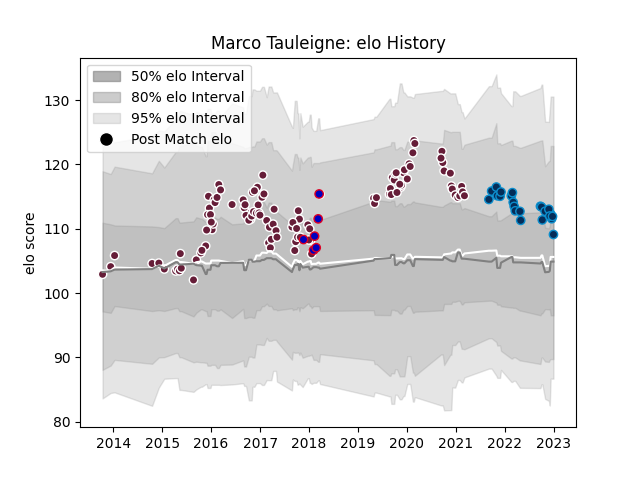

---  
layout: page  
title: Marco Tauleigne  
date: 2023-02-02 19:07:40.502916  
categories: player  
---
# Marco Tauleigne

## Positions: N8

## Country: France

## Current elo: 96.0

## Current Percentile: 52.0

# Elo History

# Match History

| Team                |   Appearances |   Win Rate |
|:--------------------|--------------:|-----------:|
| Bordeaux Begles     |           108 |   0.555556 |
| Montpellier Herault |            25 |   0.52     |
| France              |             6 |   0.333333 |

| Opponent             |   Matches |   Win Rate |
|:---------------------|----------:|-----------:|
| Clermont Auvergne    |        13 |   0.5      |
| Stade Toulousain     |        12 |   0.291667 |
| Lyon                 |        11 |   0.454545 |
| Castres Olympique    |        11 |   0.363636 |
| Stade Francais Paris |        10 |   0.7      |
| Toulon               |         9 |   0.5      |
| Brive                |         6 |   0.583333 |
| Pau                  |         6 |   0.666667 |
| Bayonne              |         5 |   0.8      |
| Racing 92            |         5 |   0.2      |
| La Rochelle          |         4 |   0.5      |
| Montpellier Herault  |         4 |   0.625    |
| Agen                 |         4 |   1        |
| Exeter Chiefs        |         4 |   0.5      |
| Ospreys              |         3 |   0.333333 |
| Grenoble             |         3 |   1        |
| Dragons              |         3 |   0.666667 |
| Edinburgh            |         3 |   0.5      |
| Oyonnax              |         2 |   1        |
| Ulster               |         2 |   1        |
| Bordeaux Begles      |         2 |   0        |
| Perpignan            |         2 |   1        |
| Wasps                |         2 |   1        |
| Newcastle Falcons    |         1 |   0        |
| Italy                |         1 |   1        |
| England              |         1 |   1        |
| New Zealand          |         1 |   0        |
| RC Enisei            |         1 |   1        |
| Mogliano             |         1 |   1        |
| Scotland             |         1 |   0        |
| Bath Rugby           |         1 |   0        |
| Bristol Rugby        |         1 |   0        |
| London Welsh         |         1 |   1        |
| London Irish         |         1 |   1        |
| Wales                |         1 |   0        |
| Ireland              |         1 |   0        |