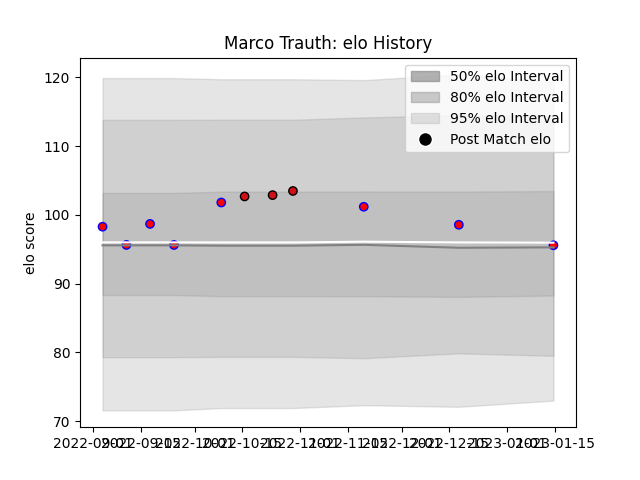

---  
layout: page  
title: Marco Trauth  
date: 2023-03-21 18:54:21.367124  
categories: player  
---
# Marco Trauth

Last updated: 2023-03-21
## Positions: P

## Current elo: 91.0

## Current Percentile: 43.0

# Elo History

# Match History

| Team             |   Appearances |   Win Rate |
|:-----------------|--------------:|-----------:|
| Blagnac          |            10 |   0.7      |
| Stade Toulousain |             3 |   0.666667 |

| Opponent                   |   Matches |   Win Rate |
|:---------------------------|----------:|-----------:|
| Tarbes                     |         2 |       0.75 |
| US Bressane                |         2 |       0.5  |
| Valence Romans Drome Rugby |         2 |       0.5  |
| Albi                       |         1 |       1    |
| Bayonne                    |         1 |       0    |
| Brive                      |         1 |       1    |
| Chambery                   |         1 |       1    |
| La Rochelle                |         1 |       1    |
| Narbonne                   |         1 |       0.5  |
| Rennes                     |         1 |       1    |