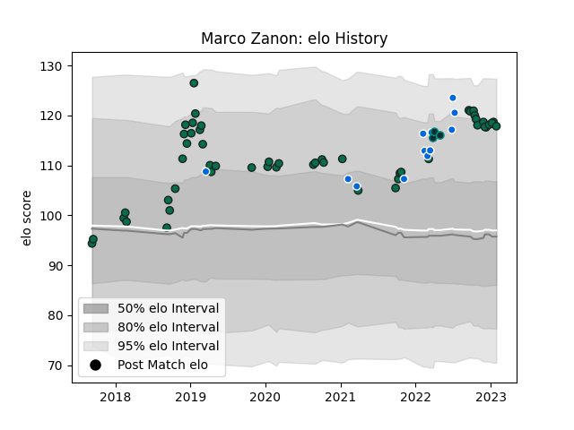

---  
layout: page  
title: Marco Zanon  
date: 2022-12-09 13:16:09.031364  
categories: player  
---
# Marco Zanon

## Positions: C

## Country: Italy

## Current elo: 106.0

## Current Percentile: 81.0

# Elo History

# Match History

| Team             |   Appearances |   Win Rate |
|:-----------------|--------------:|-----------:|
| Benetton Treviso |            47 |   0.425532 |
| Italy            |            11 |   0.181818 |
| Pau              |             3 |   0.666667 |

| Opponent           |   Matches |   Win Rate |
|:-------------------|----------:|-----------:|
| Leinster           |         5 |   0.1      |
| Edinburgh          |         4 |   0.75     |
| Ulster             |         4 |   0.125    |
| Scarlets           |         4 |   0.5      |
| Glasgow Warriors   |         4 |   0.5      |
| Dragons            |         4 |   1        |
| France             |         3 |   0        |
| Zebre              |         3 |   0.333333 |
| Ospreys            |         2 |   0        |
| Munster            |         2 |   0        |
| Southern Kings     |         2 |   1        |
| Scotland           |         2 |   0        |
| Cardiff Blues      |         2 |   0.5      |
| Connacht           |         2 |   0        |
| Agen               |         2 |   0.5      |
| Harlequins         |         2 |   0.5      |
| Biarritz Olympique |         1 |   1        |
| Ireland            |         1 |   0        |
| New Zealand        |         1 |   0        |
| Northampton Saints |         1 |   0        |
| Perpignan          |         1 |   1        |
| Racing 92          |         1 |   0        |
| Romania            |         1 |   1        |
| Grenoble           |         1 |   1        |
| Cheetahs           |         1 |   0        |
| Georgia            |         1 |   0        |
| Stormers           |         1 |   1        |
| Bulls              |         1 |   0        |
| Wales              |         1 |   1        |
| England            |         1 |   0        |