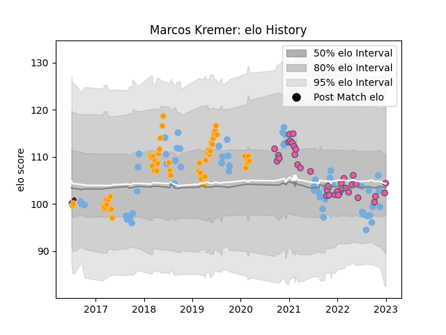

---  
layout: page  
title: Marcos Kremer  
date: 2023-02-02 18:40:21.214924  
categories: player  
---
# Marcos Kremer

## Positions: FL, L

## Country: Argentina

## Current elo: 93.0

## Current Percentile: 46.0

# Elo History

# Match History

| Team                 |   Appearances |   Win Rate |
|:---------------------|--------------:|-----------:|
| Argentina            |            58 |   0.275862 |
| Jaguares             |            52 |   0.576923 |
| Stade Francais Paris |            40 |   0.5      |
| Atlético del Rosario |             2 |   0.5      |

| Opponent                 |   Matches |   Win Rate |
|:-------------------------|----------:|-----------:|
| Australia                |        14 |   0.25     |
| New Zealand              |        12 |   0.166667 |
| Lions                    |        10 |   0.5      |
| South Africa             |        10 |   0.1      |
| Sharks                   |         7 |   0.428571 |
| Bulls                    |         6 |   0.666667 |
| Wales                    |         5 |   0.3      |
| Pau                      |         5 |   0.6      |
| Scotland                 |         5 |   0.4      |
| Castres Olympique        |         4 |   0.75     |
| Stormers                 |         4 |   0.25     |
| Clermont Auvergne        |         4 |   0.25     |
| Queensland Reds          |         4 |   0.75     |
| Perpignan                |         4 |   0.75     |
| Brumbies                 |         3 |   1        |
| Chiefs                   |         3 |   0.666667 |
| England                  |         3 |   0.333333 |
| Hurricanes               |         3 |   0.333333 |
| Stade Toulousain         |         2 |   0.5      |
| Racing 92                |         2 |   0.5      |
| Sunwolves                |         2 |   1        |
| Toulon                   |         2 |   0.5      |
| New South Wales Waratahs |         2 |   1        |
| Lyon                     |         2 |   0.5      |
| Agen                     |         2 |   1        |
| La Rochelle              |         2 |   0        |
| Bordeaux Begles          |         2 |   0        |
| Italy                    |         2 |   1        |
| Ireland                  |         2 |   0        |
| Highlanders              |         2 |   0        |
| France                   |         2 |   0        |
| Crusaders                |         2 |   0        |
| Connacht                 |         2 |   0.5      |
| Brive                    |         2 |   0.5      |
| Blues                    |         2 |   1        |
| United States of America |         1 |   1        |
| Bayonne                  |         1 |   0        |
| Tonga                    |         1 |   1        |
| Biarritz Olympique       |         1 |   1        |
| Alumni                   |         1 |   1        |
| Southern Kings           |         1 |   1        |
| Bristol Rugby            |         1 |   0        |
| Melbourne Rebels         |         1 |   1        |
| Romania                  |         1 |   1        |
| Regatas Bella Vista      |         1 |   0        |
| Montpellier Herault      |         1 |   0        |
| Cheetahs                 |         1 |   1        |