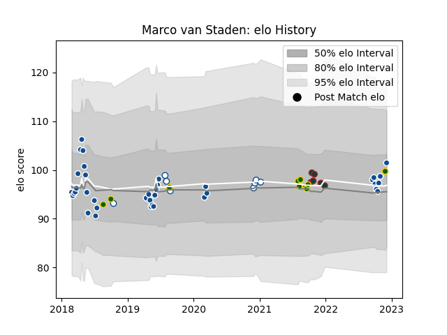

---  
layout: page  
title: Marco van Staden  
date: 2023-02-02 19:12:31.284811  
categories: player  
---
# Marco van Staden

## Positions: FL, N8

## Country: South Africa

## Current elo: 96.0

## Current Percentile: 53.0

# Elo History

# Match History

| Team             |   Appearances |   Win Rate |
|:-----------------|--------------:|-----------:|
| Bulls            |            43 |   0.465116 |
| Blue Bulls       |            10 |   0.4      |
| South Africa     |            10 |   0.7      |
| Leicester Tigers |             8 |   1        |

| Opponent                 |   Matches |   Win Rate |
|:-------------------------|----------:|-----------:|
| Stormers                 |         4 |   0.25     |
| Sharks                   |         4 |   0.75     |
| Lions                    |         4 |   0.5      |
| Argentina                |         3 |   1        |
| Australia                |         3 |   0.333333 |
| Queensland Reds          |         3 |   0.333333 |
| Jaguares                 |         3 |   0.333333 |
| Highlanders              |         3 |   0.5      |
| Golden Lions             |         2 |   0.5      |
| Brumbies                 |         2 |   0        |
| Connacht                 |         2 |   1        |
| Crusaders                |         2 |   0        |
| Western Province         |         2 |   0.5      |
| Melbourne Rebels         |         2 |   1        |
| Free State Cheetahs      |         2 |   0.5      |
| Natal Sharks             |         2 |   0        |
| British and Irish Lions  |         2 |   1        |
| Hurricanes               |         2 |   0.5      |
| New Zealand              |         1 |   0        |
| Northampton Saints       |         1 |   1        |
| Pumas                    |         1 |   1        |
| Cardiff Blues            |         1 |   1        |
| Bordeaux Begles          |         1 |   1        |
| Sale Sharks              |         1 |   1        |
| Scarlets                 |         1 |   0        |
| Blues                    |         1 |   0.5      |
| Benetton Treviso         |         1 |   1        |
| Sunwolves                |         1 |   0        |
| New South Wales Waratahs |         1 |   1        |
| London Irish             |         1 |   1        |
| Munster                  |         1 |   0        |
| Lyon                     |         1 |   0        |
| Chiefs                   |         1 |   0        |
| Bristol Rugby            |         1 |   1        |
| Harlequins               |         1 |   1        |
| Griquas                  |         1 |   0        |
| Glasgow Warriors         |         1 |   0        |
| Exeter Chiefs            |         1 |   1        |
| England                  |         1 |   1        |
| Edinburgh                |         1 |   1        |
| Dragons                  |         1 |   1        |
| Worcester Warriors       |         1 |   1        |