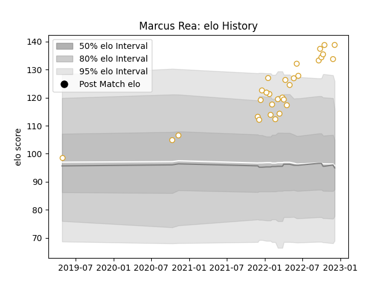

---  
layout: page  
title: Marcus Rea  
date: 2023-03-06 11:23:39.652618  
categories: player  
---
# Marcus Rea

## Positions: FL

## Current elo: 139.0

## Current Percentile: 97.0

# Elo History

# Match History

| Team   |   Appearances |   Win Rate |
|:-------|--------------:|-----------:|
| Ulster |            30 |   0.733333 |

| Opponent           |   Matches |   Win Rate |
|:-------------------|----------:|-----------:|
| Leinster           |         5 |   0.6      |
| Ospreys            |         3 |   0.666667 |
| Clermont Auvergne  |         2 |   1        |
| Connacht           |         2 |   1        |
| Stormers           |         2 |   0        |
| Stade Toulousain   |         2 |   0.5      |
| Scarlets           |         2 |   1        |
| Munster            |         2 |   0.5      |
| Northampton Saints |         2 |   1        |
| Bulls              |         1 |   0        |
| Sharks             |         1 |   1        |
| Lions              |         1 |   1        |
| Cardiff Blues      |         1 |   1        |
| Glasgow Warriors   |         1 |   1        |
| Edinburgh          |         1 |   1        |
| Dragons            |         1 |   1        |
| Zebre              |         1 |   1        |