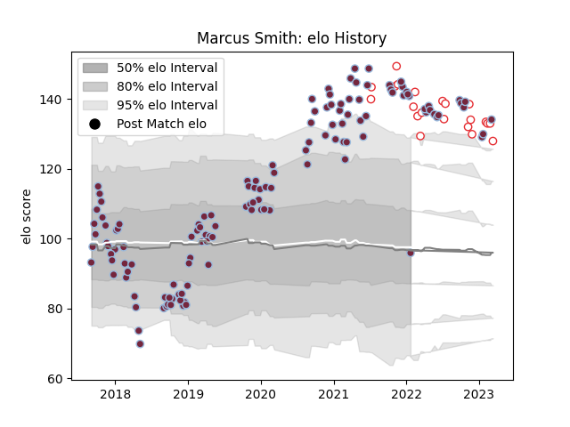

---  
layout: page  
title: Marcus Smith  
date: 2023-03-21 18:35:56.892082  
categories: player  
---
# Marcus Smith

Last updated: 2023-03-21
## Positions: FH

## Country: England

## Current elo: 96.0

## Current Percentile: 98.0

# Elo History

# Match History

| Team       |   Appearances |   Win Rate |
|:-----------|--------------:|-----------:|
| Harlequins |           130 |   0.5      |
| England    |            22 |   0.568182 |

| Opponent                 |   Matches |   Win Rate |
|:-------------------------|----------:|-----------:|
| Exeter Chiefs            |        13 |   0.384615 |
| Leicester Tigers         |        10 |   0.35     |
| Wasps                    |        10 |   0.6      |
| Northampton Saints       |        10 |   0.5      |
| Gloucester Rugby         |        10 |   0.8      |
| Bath Rugby               |         9 |   0.666667 |
| Sale Sharks              |         9 |   0.555556 |
| Worcester Warriors       |         8 |   0.625    |
| Bristol Rugby            |         8 |   0.5      |
| London Irish             |         7 |   0.5      |
| Saracens                 |         6 |   0.166667 |
| Newcastle Falcons        |         6 |   0.5      |
| Australia                |         4 |   0.75     |
| Clermont Auvergne        |         3 |   0        |
| Ulster                   |         3 |   0        |
| Castres Olympique        |         2 |   1        |
| Wales                    |         2 |   1        |
| South Africa             |         2 |   0.5      |
| Scotland                 |         2 |   0        |
| Benetton Treviso         |         2 |   0.5      |
| Racing 92                |         2 |   0        |
| Agen                     |         2 |   1        |
| Montpellier Herault      |         2 |   0.5      |
| La Rochelle              |         2 |   0        |
| Italy                    |         2 |   1        |
| Ireland                  |         2 |   0        |
| Grenoble                 |         2 |   0.5      |
| France                   |         2 |   0        |
| Cardiff Blues            |         2 |   1        |
| Munster                  |         1 |   0        |
| Argentina                |         1 |   0        |
| Japan                    |         1 |   1        |
| Sharks                   |         1 |   1        |
| Tonga                    |         1 |   1        |
| Canada                   |         1 |   1        |
| United States of America |         1 |   1        |
| New Zealand              |         1 |   0.5      |