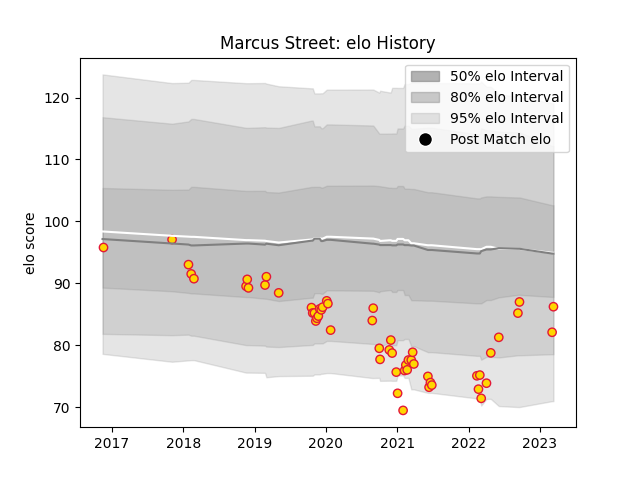

---  
layout: page  
title: Marcus Street  
date: 2023-03-06 11:22:38.800735  
categories: player  
---
# Marcus Street

## Positions: P

## Current elo: 87.0

## Current Percentile: 19.0

# Elo History

# Match History

| Team          |   Appearances |   Win Rate |
|:--------------|--------------:|-----------:|
| Exeter Chiefs |            53 |   0.707547 |

| Opponent           |   Matches |   Win Rate |
|:-------------------|----------:|-----------:|
| Sale Sharks        |         8 |   0.75     |
| Harlequins         |         6 |   0.666667 |
| Worcester Warriors |         6 |   0.666667 |
| Northampton Saints |         5 |   0.8      |
| Gloucester Rugby   |         4 |   0.75     |
| Bath Rugby         |         3 |   0.666667 |
| Bristol Rugby      |         3 |   0.666667 |
| Leicester Tigers   |         3 |   1        |
| London Irish       |         3 |   0.666667 |
| Newcastle Falcons  |         3 |   1        |
| Wasps              |         3 |   0.333333 |
| Glasgow Warriors   |         2 |   0.75     |
| Saracens           |         2 |   0        |
| Cardiff Blues      |         1 |   1        |
| La Rochelle        |         1 |   1        |