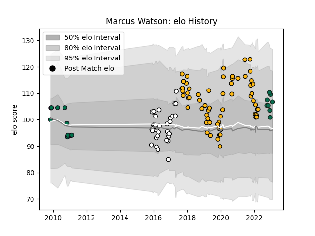

---  
layout: page  
title: Marcus Watson  
date: 2022-12-14 11:17:29.702430  
categories: player  
---
# Marcus Watson

## Positions: W, FB

## Current elo: 92.0

## Current Percentile: 40.0

# Elo History

# Match History

| Team              |   Appearances |   Win Rate |
|:------------------|--------------:|-----------:|
| Wasps             |            63 |   0.460317 |
| Newcastle Falcons |            35 |   0.385714 |
| London Irish      |            12 |   0.333333 |
| Benetton Treviso  |             6 |   0.5      |

| Opponent             |   Matches |   Win Rate |
|:---------------------|----------:|-----------:|
| Bath Rugby           |        10 |   0.7      |
| Northampton Saints   |         9 |   0.444444 |
| Leicester Tigers     |         8 |   0.375    |
| Harlequins           |         8 |   0.25     |
| Saracens             |         8 |   0.25     |
| Worcester Warriors   |         8 |   0.75     |
| Exeter Chiefs        |         7 |   0.428571 |
| Gloucester Rugby     |         7 |   0.428571 |
| Wasps                |         6 |   0        |
| Sale Sharks          |         5 |   0.3      |
| London Irish         |         5 |   0.6      |
| Newcastle Falcons    |         5 |   0.4      |
| Bristol Rugby        |         5 |   0.8      |
| Connacht             |         3 |   0.333333 |
| Munster              |         3 |   0        |
| Edinburgh            |         2 |   0.5      |
| Ulster               |         2 |   0.5      |
| Scarlets             |         2 |   0.5      |
| Ospreys              |         1 |   0        |
| Stade Francais Paris |         1 |   0        |
| Bordeaux Begles      |         1 |   0        |
| RC Enisei            |         1 |   1        |
| Lyon                 |         1 |   0        |
| Dragons              |         1 |   1        |
| Leinster             |         1 |   0        |
| Brive                |         1 |   0        |
| La Rochelle          |         1 |   0        |
| Cardiff Blues        |         1 |   1        |
| Grenoble             |         1 |   1        |
| Glasgow Warriors     |         1 |   0        |
| Agen                 |         1 |   1        |