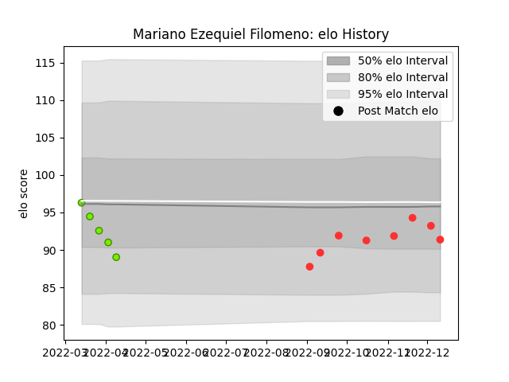

---  
layout: page  
title: Mariano Ezequiel Filomeno  
date: 2023-03-17 17:12:32.971083  
categories: player  
---
# Mariano Ezequiel Filomeno

## Positions: P

## Current elo: 87.0

## Current Percentile: 34.0

# Elo History

# Match History

| Team   |   Appearances |   Win Rate |
|:-------|--------------:|-----------:|
| Tarbes |            14 |   0.607143 |
| Cobras |             5 |   0        |

| Opponent                   |   Matches |   Win Rate |
|:---------------------------|----------:|-----------:|
| Narbonne                   |         2 |        1   |
| Cognac Saint Jean d'Angély |         2 |        1   |
| Albi                       |         1 |        1   |
| Suresnes                   |         1 |        0   |
| Selknam                    |         1 |        0   |
| Rennes                     |         1 |        1   |
| Penarol Rugby              |         1 |        0   |
| Olimpia Lions              |         1 |        0   |
| Nice                       |         1 |        1   |
| Jaguares XV                |         1 |        0   |
| Blagnac                    |         1 |        0.5 |
| Dax                        |         1 |        0   |
| Chambery                   |         1 |        0   |
| Carqueiranne-Hyères        |         1 |        1   |
| Cafeteros Pro              |         1 |        0   |
| Bourgoin-Jallieu           |         1 |        0   |
| US Bressane                |         1 |        0   |