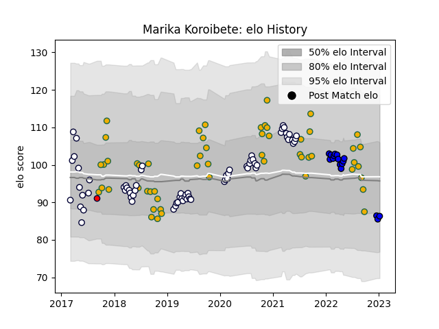

---  
layout: page  
title: Marika Koroibete  
date: 2022-12-18 16:38:49.641794  
categories: player  
---
# Marika Koroibete

## Positions: W

## Country: Australia

## Current elo: 103.0

## Current Percentile: 79.0

# Elo History

# Match History

| Team                 |   Appearances |   Win Rate |
|:---------------------|--------------:|-----------:|
| Melbourne Rebels     |            69 |   0.34058  |
| Australia            |            54 |   0.472222 |
| Saitama Wild Knights |            13 |   1        |
| Melbourne Rising     |             1 |   0        |

| Opponent                          |   Matches |   Win Rate |
|:----------------------------------|----------:|-----------:|
| New Zealand                       |        16 |   0.21875  |
| Argentina                         |        11 |   0.681818 |
| Brumbies                          |        11 |   0.545455 |
| New South Wales Waratahs          |        10 |   0.4      |
| Queensland Reds                   |         9 |   0.277778 |
| South Africa                      |         7 |   0.642857 |
| England                           |         6 |   0.166667 |
| Western Force                     |         5 |   0.6      |
| Highlanders                       |         5 |   0.4      |
| Sunwolves                         |         4 |   0.75     |
| Crusaders                         |         4 |   0        |
| Hurricanes                        |         4 |   0        |
| Ireland                           |         3 |   0.333333 |
| Lions                             |         3 |   0.333333 |
| Chiefs                            |         3 |   0        |
| France                            |         3 |   0.666667 |
| Yokohama Canon Eagles             |         2 |   1        |
| Bulls                             |         2 |   0        |
| Kobelco Kobe Steelers             |         2 |   1        |
| Wales                             |         2 |   0.5      |
| Blues                             |         2 |   0.5      |
| Urayasu D-Rocks                   |         2 |   1        |
| Toshiba Brave Lupus Tokyo         |         2 |   1        |
| Stormers                          |         2 |   0        |
| Jaguares                          |         2 |   0        |
| Sharks                            |         2 |   0.5      |
| Fiji                              |         1 |   1        |
| Tokyo Sungoliath                  |         1 |   1        |
| Southern Kings                    |         1 |   0        |
| Italy                             |         1 |   1        |
| Shizuoka Blue Revs                |         1 |   1        |
| Samoa                             |         1 |   1        |
| Perth Spirit                      |         1 |   0        |
| Georgia                           |         1 |   1        |
| Green Rockets Tokatsu             |         1 |   1        |
| NTT Docomo Red Hurricanes Osaka   |         1 |   1        |
| Kubota Spears Funabashi Tokyo-Bay |         1 |   1        |
| Japan                             |         1 |   1        |
| Scotland                          |         1 |   0        |