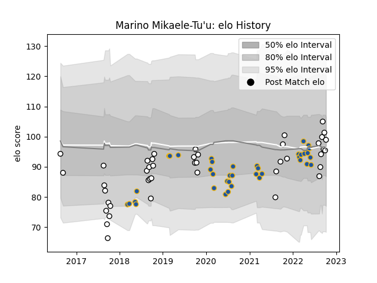

---  
layout: page  
title: Marino Mikaele-Tu'u  
date: 2023-03-02 11:28:34.250366  
categories: player  
---
# Marino Mikaele-Tu'u

## Positions: N8, FL

## Current elo: 99.0

## Current Percentile: 48.0

# Elo History

# Match History

| Team        |   Appearances |   Win Rate |
|:------------|--------------:|-----------:|
| Hawke's Bay |            43 |   0.453488 |
| Highlanders |            38 |   0.394737 |

| Opponent                 |   Matches |   Win Rate |
|:-------------------------|----------:|-----------:|
| Bay of Plenty            |         6 |   0.333333 |
| Blues                    |         6 |   0.166667 |
| Crusaders                |         6 |   0        |
| Otago                    |         5 |   0.6      |
| Tasman                   |         5 |   0.4      |
| Hurricanes               |         5 |   0.2      |
| Chiefs                   |         4 |   0.75     |
| Counties Manukau         |         4 |   0.5      |
| Manawatu                 |         3 |   1        |
| North Harbour            |         3 |   0.333333 |
| Melbourne Rebels         |         3 |   0        |
| Taranaki                 |         3 |   0.333333 |
| Southland                |         3 |   1        |
| Canterbury               |         3 |   0        |
| Waikato                  |         3 |   0.5      |
| Wellington               |         3 |   0        |
| Queensland Reds          |         3 |   1        |
| New South Wales Waratahs |         2 |   0        |
| Northland                |         2 |   0.5      |
| Stormers                 |         1 |   1        |
| Moana Pasifika           |         1 |   1        |
| Sharks                   |         1 |   0        |
| Lions                    |         1 |   1        |
| Jaguares                 |         1 |   1        |
| Fijian Drua              |         1 |   1        |
| Bulls                    |         1 |   0        |
| Brumbies                 |         1 |   1        |
| Western Force            |         1 |   1        |