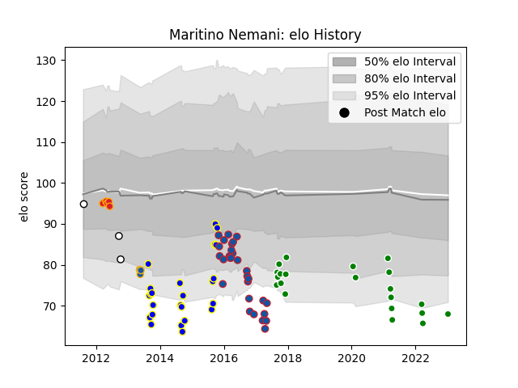

---  
layout: page  
title: Maritino Nemani  
date: 2023-01-13 11:27:27.411808  
categories: player  
---
# Maritino Nemani

## Positions: C, W

## Current elo: 68.0

## Current Percentile: 2.0

# Elo History

# Match History

| Team                  |   Appearances |   Win Rate |
|:----------------------|--------------:|-----------:|
| Grenoble              |            29 |   0.362069 |
| Bay of Plenty         |            24 |   0.166667 |
| Green Rockets Tokatsu |            21 |   0.238095 |
| Chiefs                |             5 |   1        |
| Hawke's Bay           |             3 |   0        |
| Highlanders           |             3 |   0        |

| Opponent                          |   Matches |   Win Rate |
|:----------------------------------|----------:|-----------:|
| Southland                         |         4 |   0.25     |
| Hawke's Bay                       |         3 |   0        |
| Waikato                           |         3 |   0        |
| Toulon                            |         3 |   0.5      |
| Castres Olympique                 |         3 |   0.333333 |
| Stade Toulousain                  |         3 |   0        |
| Kobelco Kobe Steelers             |         3 |   0        |
| Oyonnax                           |         2 |   1        |
| Northland                         |         2 |   0.5      |
| Saitama Wild Knights              |         2 |   0        |
| Auckland                          |         2 |   0        |
| Shizuoka Blue Revs                |         2 |   0        |
| Manawatu                          |         2 |   0        |
| Lyon                              |         2 |   0.5      |
| Taranaki                          |         2 |   0        |
| Hino Red Dolphins                 |         2 |   0        |
| Yokohama Canon Eagles             |         2 |   0.5      |
| Tasman                            |         2 |   0        |
| Counties Manukau                  |         2 |   0.5      |
| Clermont Auvergne                 |         2 |   0        |
| Bulls                             |         2 |   0.5      |
| Wellington                        |         2 |   0        |
| Bayonne                           |         2 |   0.5      |
| Pau                               |         2 |   0        |
| Tokyo Sungoliath                  |         1 |   0        |
| Toshiba Brave Lupus Tokyo         |         1 |   0        |
| Toyota Industries Shuttles Aichi  |         1 |   1        |
| Southern Kings                    |         1 |   0        |
| Toyota Verblitz                   |         1 |   0        |
| Sharks                            |         1 |   1        |
| Western Force                     |         1 |   0        |
| Racing 92                         |         1 |   0        |
| Agen                              |         1 |   1        |
| Otago                             |         1 |   0        |
| Ospreys                           |         1 |   0        |
| Black Rams Tokyo                  |         1 |   0        |
| Blues                             |         1 |   1        |
| Bordeaux Begles                   |         1 |   0        |
| Brive                             |         1 |   1        |
| Brumbies                          |         1 |   1        |
| Canterbury                        |         1 |   0        |
| Coca-Cola Red Sparks              |         1 |   1        |
| Connacht                          |         1 |   1        |
| Edinburgh                         |         1 |   0        |
| Kubota Spears Funabashi Tokyo-Bay |         1 |   1        |
| La Rochelle                       |         1 |   1        |
| Lions                             |         1 |   1        |
| Mitsubishi Dynaboars              |         1 |   0        |
| Montpellier Herault               |         1 |   0        |
| NTT Docomo Red Hurricanes Osaka   |         1 |   0        |
| Newcastle Falcons                 |         1 |   0        |
| North Harbour                     |         1 |   1        |
| Munakata Sanix Blues              |         1 |   1        |