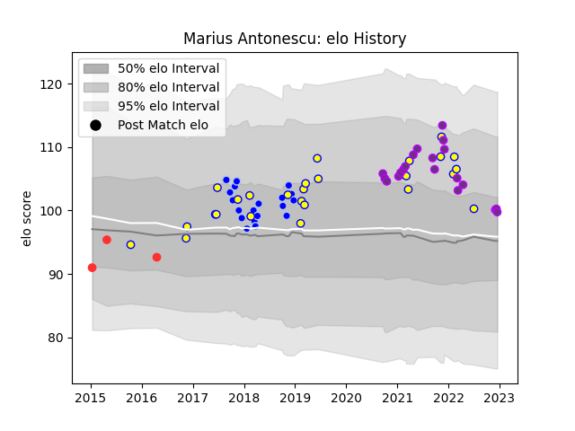

---  
layout: page  
title: Marius Antonescu  
date: 2022-12-14 11:34:35.376917  
categories: player  
---
# Marius Antonescu

## Positions: L

## Country: Romania

## Current elo: 100.0

## Current Percentile: 70.0

# Elo History

# Match History

| Team        |   Appearances |   Win Rate |
|:------------|--------------:|-----------:|
| Romania     |            26 |   0.653846 |
| Colomiers   |            19 |   0.368421 |
| US Bressane |            19 |   0.605263 |
| Tarbes      |             3 |   0.333333 |

| Opponent                   |   Matches |   Win Rate |
|:---------------------------|----------:|-----------:|
| Nevers                     |         4 |   0        |
| Mont-de-Marsan             |         4 |   0.25     |
| Bayonne                    |         4 |   0        |
| Spain                      |         4 |   0.25     |
| Tarbes                     |         3 |   0.666667 |
| Massy                      |         3 |   0.666667 |
| Russia                     |         3 |   0.666667 |
| Canada                     |         2 |   1        |
| Georgia                    |         2 |   0        |
| Narbonne                   |         2 |   0.5      |
| Montauban                  |         2 |   0.5      |
| Beziers                    |         2 |   1        |
| Italy                      |         2 |   0        |
| Germany                    |         2 |   1        |
| Grenoble                   |         2 |   0.5      |
| Dijon                      |         2 |   1        |
| Portugal                   |         2 |   1        |
| Brazil                     |         2 |   1        |
| Vannes                     |         2 |   0        |
| United States of America   |         1 |   1        |
| Uruguay                    |         1 |   1        |
| Samoa                      |         1 |   1        |
| Valence Romans Drome Rugby |         1 |   1        |
| Suresnes                   |         1 |   1        |
| Rouen                      |         1 |   0.5      |
| Agen                       |         1 |   0        |
| Perpignan                  |         1 |   1        |
| Netherlands                |         1 |   1        |
| Dax                        |         1 |   0        |
| Cognac Saint Jean d'Angély |         1 |   1        |
| Chile                      |         1 |   1        |
| Chambery                   |         1 |   1        |
| Carcassonne                |         1 |   0        |
| Brive                      |         1 |   1        |
| Biarritz Olympique         |         1 |   1        |
| Belgium                    |         1 |   1        |
| Japan                      |         1 |   0        |