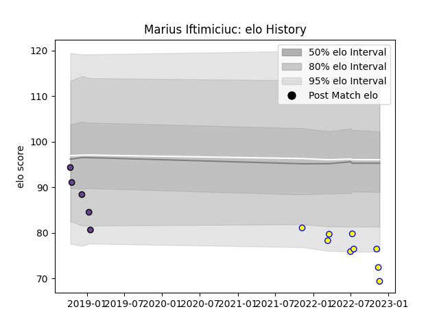

---  
layout: page  
title: Marius Iftimiciuc  
date: 2023-02-05 15:12:49.243838  
categories: player  
---
# Marius Iftimiciuc

## Positions: L

## Country: Romania

## Current elo: 77.0

## Current Percentile: 5.0

# Elo History

# Match History

| Team               |   Appearances |   Win Rate |
|:-------------------|--------------:|-----------:|
| Romania            |            16 |     0.5625 |
| Timisoara Saracens |             6 |     0      |

| Opponent                 |   Matches |   Win Rate |
|:-------------------------|----------:|-----------:|
| Uruguay                  |         4 |        0.5 |
| Clermont Auvergne        |         2 |        0   |
| Dragons                  |         2 |        0   |
| Georgia                  |         2 |        0   |
| Netherlands              |         2 |        1   |
| Northampton Saints       |         2 |        0   |
| Brazil                   |         1 |        1   |
| Chile                    |         1 |        1   |
| Italy                    |         1 |        0   |
| Poland                   |         1 |        1   |
| Portugal                 |         1 |        1   |
| Samoa                    |         1 |        0   |
| Spain                    |         1 |        1   |
| United States of America |         1 |        0   |