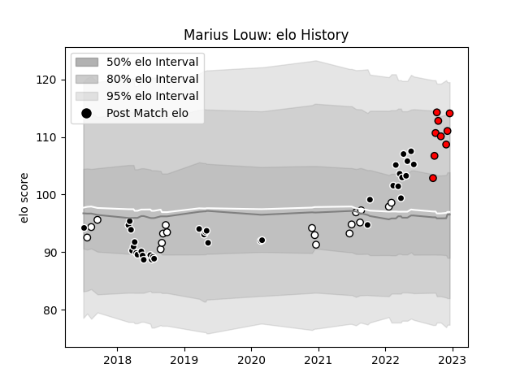

---  
layout: page  
title: Marius Louw  
date: 2023-01-06 00:15:40.570430  
categories: player  
---
# Marius Louw

## Positions: C

## Current elo: 117.0

## Current Percentile: 87.0

# Elo History

# Match History

| Team         |   Appearances |   Win Rate |
|:-------------|--------------:|-----------:|
| Sharks       |            37 |   0.567568 |
| Natal Sharks |            26 |   0.730769 |
| Lions        |            11 |   0.545455 |

| Opponent                 |   Matches |   Win Rate |
|:-------------------------|----------:|-----------:|
| Free State Cheetahs      |         6 |   0.833333 |
| Bulls                    |         6 |   0.166667 |
| Griquas                  |         5 |   0.8      |
| Western Province         |         5 |   0.4      |
| Stormers                 |         4 |   0.25     |
| Pumas                    |         4 |   0.75     |
| Golden Lions             |         4 |   0.75     |
| Melbourne Rebels         |         3 |   0.666667 |
| New South Wales Waratahs |         2 |   0.75     |
| Queensland Reds          |         2 |   0.5      |
| Lions                    |         2 |   1        |
| Scarlets                 |         2 |   1        |
| Blue Bulls               |         2 |   1        |
| Jaguares                 |         2 |   0.5      |
| Edinburgh                |         2 |   0.5      |
| Dragons                  |         2 |   1        |
| Crusaders                |         2 |   0.25     |
| Chiefs                   |         2 |   0.5      |
| Ulster                   |         2 |   0        |
| Ospreys                  |         2 |   1        |
| Stade Francais Paris     |         1 |   1        |
| Sharks                   |         1 |   0        |
| Sunwolves                |         1 |   1        |
| Benetton Treviso         |         1 |   1        |
| Munster                  |         1 |   0        |
| Leinster                 |         1 |   1        |
| Hurricanes               |         1 |   0        |
| Highlanders              |         1 |   1        |
| Connacht                 |         1 |   1        |
| Cardiff Blues            |         1 |   1        |
| Brumbies                 |         1 |   0        |
| Blues                    |         1 |   1        |
| Zebre                    |         1 |   1        |