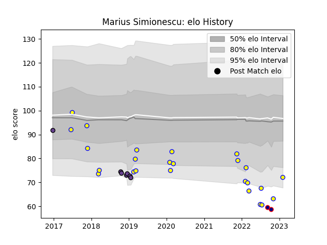

---  
layout: page  
title: Marius Simionescu  
date: 2023-02-04 18:29:55.329217  
categories: player  
---
# Marius Simionescu

## Positions: FB, W

## Country: Romania

## Current elo: 72.0

## Current Percentile: 3.0

# Elo History

# Match History

| Team               |   Appearances |   Win Rate |
|:-------------------|--------------:|-----------:|
| Romania            |            25 |        0.6 |
| Timisoara Saracens |             7 |        0   |
| Romanian Wolves    |             2 |        0   |

| Opponent           |   Matches |   Win Rate |
|:-------------------|----------:|-----------:|
| Spain              |         3 |   0.333333 |
| Russia             |         3 |   0.666667 |
| Georgia            |         3 |   0        |
| Belgium            |         2 |   1        |
| Northampton Saints |         2 |   0        |
| Tonga              |         2 |   0.5      |
| Portugal           |         2 |   0.5      |
| Uruguay            |         2 |   0.5      |
| Dragons            |         2 |   0        |
| Clermont Auvergne  |         2 |   0        |
| Harlequins         |         1 |   0        |
| Italy              |         1 |   0        |
| Brazil             |         1 |   1        |
| Germany            |         1 |   1        |
| Poland             |         1 |   1        |
| RC Batumi          |         1 |   0        |
| Samoa              |         1 |   1        |
| Chile              |         1 |   1        |
| Tel-Aviv Heat      |         1 |   0        |
| Canada             |         1 |   1        |
| Netherlands        |         1 |   1        |