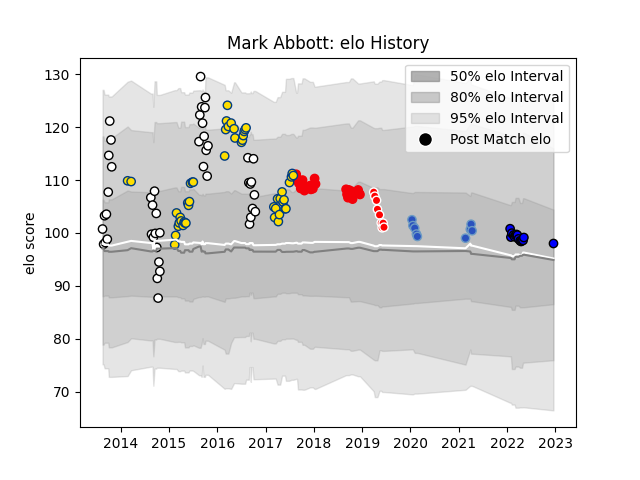

---  
layout: page  
title: Mark Abbott  
date: 2023-03-21 18:40:46.908898  
categories: player  
---
# Mark Abbott

Last updated: 2023-03-21
## Positions: L

## Country: Hurricanes

## Current elo: 98.0

## Current Percentile: 58.0

# Elo History

# Match History

| Team                 |   Appearances |   Win Rate |
|:---------------------|--------------:|-----------:|
| Hurricanes           |            49 |   0.765306 |
| Hawke's Bay          |            46 |   0.543478 |
| Coca-Cola Red Sparks |            25 |   0.04     |
| Saitama Wild Knights |            15 |   1        |
| Munakata Sanix Blues |             9 |   0.222222 |
| Sunwolves            |             9 |   0.111111 |

| Opponent                          |   Matches |   Win Rate |
|:----------------------------------|----------:|-----------:|
| Highlanders                       |         7 |   0.428571 |
| Brumbies                          |         6 |   0.5      |
| Yokohama Canon Eagles             |         5 |   0.4      |
| Crusaders                         |         5 |   0.6      |
| Bay of Plenty                     |         5 |   0.6      |
| Melbourne Rebels                  |         5 |   0.6      |
| Manawatu                          |         5 |   0.4      |
| Kubota Spears Funabashi Tokyo-Bay |         5 |   0.2      |
| Toshiba Brave Lupus Tokyo         |         5 |   0.4      |
| Urayasu D-Rocks                   |         5 |   0.4      |
| Wellington                        |         5 |   0.7      |
| Blues                             |         5 |   1        |
| Sharks                            |         4 |   0.5      |
| Black Rams Tokyo                  |         4 |   0.25     |
| Green Rockets Tokatsu             |         4 |   0.5      |
| Southland                         |         4 |   0.875    |
| Otago                             |         4 |   1        |
| Northland                         |         4 |   0.75     |
| Tasman                            |         4 |   0        |
| New South Wales Waratahs          |         4 |   0.75     |
| Counties Manukau                  |         4 |   0.5      |
| Queensland Reds                   |         3 |   1        |
| North Harbour                     |         3 |   0.666667 |
| NTT Docomo Red Hurricanes Osaka   |         3 |   0.666667 |
| Chiefs                            |         3 |   0.666667 |
| Stormers                          |         3 |   0.666667 |
| Lions                             |         3 |   0.666667 |
| Shizuoka Blue Revs                |         3 |   0.333333 |
| Western Force                     |         3 |   1        |
| Taranaki                          |         2 |   0.5      |
| Toyota Industries Shuttles Aichi  |         2 |   0        |
| Waikato                           |         2 |   0        |
| Toyota Verblitz                   |         2 |   0.5      |
| Auckland                          |         2 |   0.5      |
| Saitama Wild Knights              |         2 |   0        |
| Mie Honda Heat                    |         2 |   0.5      |
| Kobelco Kobe Steelers             |         2 |   1        |
| Canterbury                        |         2 |   0        |
| Bulls                             |         2 |   1        |
| Munakata Sanix Blues              |         2 |   0        |
| Southern Kings                    |         1 |   1        |
| Jaguares                          |         1 |   0        |
| Tokyo Sungoliath                  |         1 |   1        |
| Hurricanes                        |         1 |   0        |
| Hino Red Dolphins                 |         1 |   0        |
| Hanazono Kintetsu Liners          |         1 |   0        |
| Cheetahs                          |         1 |   1        |
| British and Irish Lions           |         1 |   0.5      |