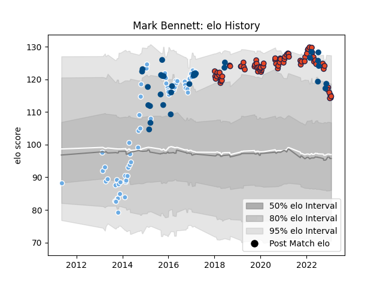

---  
layout: page  
title: Mark Bennett  
date: 2022-12-18 16:39:23.210818  
categories: player  
---
# Mark Bennett

## Positions: C

## Country: Scotland

## Current elo: 111.0

## Current Percentile: 85.0

# Elo History

# Match History

| Team             |   Appearances |   Win Rate |
|:-----------------|--------------:|-----------:|
| Edinburgh        |            71 |   0.542254 |
| Glasgow Warriors |            67 |   0.649254 |
| Scotland         |            30 |   0.366667 |

| Opponent                 |   Matches |   Win Rate |
|:-------------------------|----------:|-----------:|
| Munster                  |        14 |   0.285714 |
| Ulster                   |        13 |   0.384615 |
| Cardiff Blues            |        13 |   0.692308 |
| Scarlets                 |        12 |   0.833333 |
| Benetton Treviso         |        10 |   0.7      |
| Leinster                 |         9 |   0.5      |
| Glasgow Warriors         |         9 |   0.666667 |
| Connacht                 |         8 |   0.75     |
| Dragons                  |         8 |   0.625    |
| Zebre                    |         5 |   1        |
| Ospreys                  |         4 |   0.25     |
| Argentina                |         4 |   0.5      |
| France                   |         4 |   0        |
| Edinburgh                |         4 |   0.5      |
| England                  |         3 |   0        |
| Ireland                  |         3 |   0.333333 |
| Italy                    |         3 |   0.666667 |
| Racing 92                |         3 |   0.666667 |
| Wales                    |         3 |   0.333333 |
| Southern Kings           |         2 |   1        |
| Saracens                 |         2 |   0.5      |
| Stade Francais Paris     |         2 |   0.5      |
| Stormers                 |         2 |   0        |
| United States of America |         2 |   0.5      |
| New Zealand              |         2 |   0        |
| Leicester Tigers         |         2 |   1        |
| Montpellier Herault      |         2 |   1        |
| Bulls                    |         2 |   0.5      |
| Australia                |         2 |   0        |
| Bath Rugby               |         2 |   0.5      |
| Bordeaux Begles          |         2 |   0.25     |
| Wasps                    |         1 |   1        |
| Toulon                   |         1 |   0        |
| Brive                    |         1 |   1        |
| Canada                   |         1 |   1        |
| Northampton Saints       |         1 |   0        |
| Sharks                   |         1 |   1        |
| Exeter Chiefs            |         1 |   1        |
| Georgia                  |         1 |   1        |
| Samoa                    |         1 |   1        |
| Japan                    |         1 |   1        |
| Lions                    |         1 |   0        |
| Agen                     |         1 |   1        |