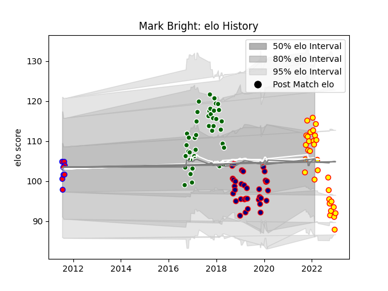

---  
layout: page  
title: Mark Bright  
date: 2022-12-14 11:14:29.381026  
categories: player  
---
# Mark Bright

## Positions: N8

## Current elo: 87.0

## Current Percentile: 27.0

# Elo History

# Match History

| Team                |   Appearances |   Win Rate |
|:--------------------|--------------:|-----------:|
| Ealing Trailfinders |            38 |   0.723684 |
| London Scottish     |            29 |   0.362069 |
| Richmond            |            28 |   0.357143 |
| Tasman              |             7 |   0.142857 |

| Opponent            |   Matches |   Win Rate |
|:--------------------|----------:|-----------:|
| Nottingham          |        11 |   0.454545 |
| Cornish Pirates     |        10 |   0.4      |
| Doncaster           |         9 |   0.333333 |
| Bedford             |         8 |   1        |
| Jersey              |         7 |   0.571429 |
| Hartpury College    |         7 |   0.571429 |
| Richmond            |         6 |   0.666667 |
| London Scottish     |         6 |   0.833333 |
| Yorkshire Carnegie  |         6 |   0.666667 |
| Ealing Trailfinders |         5 |   0        |
| Coventry            |         4 |   0.25     |
| Rotherham Titans    |         4 |   1        |
| Ampthill            |         4 |   0.25     |
| London Irish        |         3 |   0        |
| Bristol Rugby       |         2 |   0        |
| Counties Manukau    |         1 |   0        |
| Auckland            |         1 |   1        |
| Canterbury          |         1 |   0        |
| London Welsh        |         1 |   1        |
| Manawatu            |         1 |   0        |
| Newcastle Falcons   |         1 |   0        |
| North Harbour       |         1 |   0        |
| Northland           |         1 |   0        |
| Caldy               |         1 |   0        |
| Otago               |         1 |   0        |