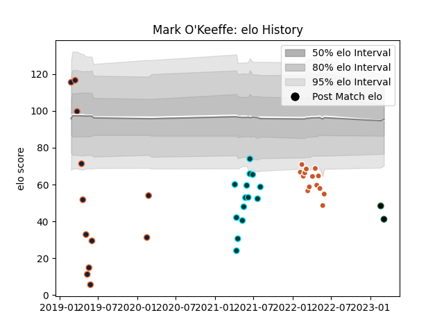

---  
layout: page  
title: Mark O'Keeffe  
date: 2023-03-21 18:01:07.573040  
categories: player  
---
# Mark O'Keeffe

Last updated: 2023-03-21
## Positions: C, W

## Current elo: 34.0

## Current Percentile: 0.0

# Elo History

# Match History

| Team             |   Appearances |   Win Rate |
|:-----------------|--------------:|-----------:|
| Austin Gilgronis |            14 |   0.714286 |
| Rugby ATL        |            14 |   0.5      |
| R.U. New York    |            13 |   0.692308 |
| Rugby New York   |            12 |   0.666667 |
| Chicago Hounds   |             3 |   0        |

| Opponent               |   Matches |   Win Rate |
|:-----------------------|----------:|-----------:|
| Utah Warriors          |         6 |   0.666667 |
| Seattle Seawolves      |         6 |   0.5      |
| San Diego Legion       |         6 |   0.333333 |
| Toronto Arrows         |         5 |   0.6      |
| Houston SaberCats      |         4 |   1        |
| L. A. Giltinis         |         4 |   0.5      |
| NOLA Gold              |         4 |   1        |
| Old Glory DC           |         3 |   0.666667 |
| New England Free Jacks |         3 |   0.333333 |
| R.U. New York          |         2 |   0        |
| Rugby ATL              |         2 |   0.5      |
| Rugby New York         |         2 |   0        |
| Glendale Raptors       |         2 |   1        |
| Dallas Jackals         |         2 |   1        |
| Austin Herd            |         2 |   1        |
| Austin Elite Rugby     |         2 |   1        |
| Austin Gilgronis       |         1 |   0        |