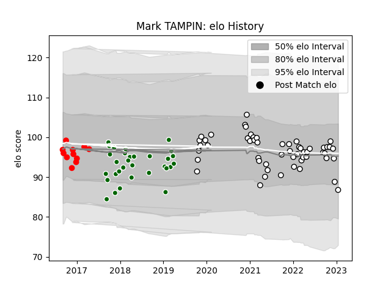

---  
layout: page  
title: Mark TAMPIN  
date: 2023-03-11 00:13:18.282322  
categories: player  
---
# Mark TAMPIN

## Positions: P

## Current elo: 96.0

## Current Percentile: 49.0

# Elo History

# Match History

| Team                |   Appearances |   Win Rate |
|:--------------------|--------------:|-----------:|
| Newcastle Falcons   |            54 |   0.416667 |
| Ealing Trailfinders |            31 |   0.741935 |
| Jersey              |            11 |   0.454545 |

| Opponent            |   Matches |   Win Rate |
|:--------------------|----------:|-----------:|
| London Irish        |         7 |   0.142857 |
| London Scottish     |         6 |   0.833333 |
| Bedford             |         6 |   0.666667 |
| Bath Rugby          |         5 |   0.4      |
| Cornish Pirates     |         5 |   0.8      |
| Richmond            |         5 |   0.8      |
| Doncaster           |         5 |   0.8      |
| Hartpury College    |         5 |   1        |
| Worcester Warriors  |         4 |   0.625    |
| Bristol Rugby       |         4 |   0        |
| Wasps               |         4 |   0.5      |
| Harlequins          |         4 |   0.25     |
| Leicester Tigers    |         4 |   0        |
| Sale Sharks         |         3 |   0.333333 |
| Nottingham          |         3 |   0.666667 |
| Northampton Saints  |         3 |   0.333333 |
| Jersey              |         3 |   1        |
| Gloucester Rugby    |         3 |   0.666667 |
| Exeter Chiefs       |         3 |   0        |
| Ealing Trailfinders |         2 |   0.5      |
| Coventry            |         2 |   1        |
| Rotherham Titans    |         2 |   0.5      |
| Saracens            |         2 |   0        |
| Yorkshire Carnegie  |         2 |   1        |
| London Welsh        |         1 |   0        |
| Connacht            |         1 |   0        |
| Cardiff Blues       |         1 |   0        |
| Biarritz Olympique  |         1 |   1        |