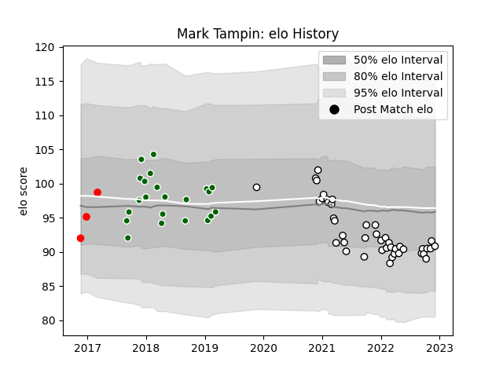

---  
layout: page  
title: Mark Tampin  
date: 2022-11-15 23:42:52.318992  
categories: player  
---
# Mark Tampin

## Positions: P

## Current elo: 91.0

## Current Percentile: 23.0

# Elo History

# Match History

| Team                |   Appearances |   Win Rate |
|:--------------------|--------------:|-----------:|
| Newcastle Falcons   |            42 |   0.297619 |
| Ealing Trailfinders |            22 |   0.727273 |
| Jersey              |             3 |   0.333333 |

| Opponent           |   Matches |   Win Rate |
|:-------------------|----------:|-----------:|
| Bath Rugby         |         5 |   0.4      |
| London Irish       |         5 |   0.2      |
| Harlequins         |         4 |   0.25     |
| Wasps              |         4 |   0.5      |
| Bedford            |         4 |   0.5      |
| Leicester Tigers   |         4 |   0        |
| Cornish Pirates    |         4 |   0.75     |
| Doncaster          |         3 |   0.666667 |
| London Scottish    |         3 |   1        |
| Worcester Warriors |         3 |   0.5      |
| Sale Sharks        |         3 |   0.333333 |
| Richmond           |         3 |   0.666667 |
| Exeter Chiefs      |         3 |   0        |
| Northampton Saints |         3 |   0.333333 |
| Gloucester Rugby   |         3 |   0.666667 |
| Hartpury College   |         2 |   1        |
| Rotherham Titans   |         2 |   0.5      |
| Saracens           |         2 |   0        |
| Bristol Rugby      |         2 |   0        |
| Cardiff Blues      |         1 |   0        |
| Jersey             |         1 |   1        |
| Nottingham         |         1 |   0        |
| Coventry           |         1 |   1        |
| Yorkshire Carnegie |         1 |   1        |