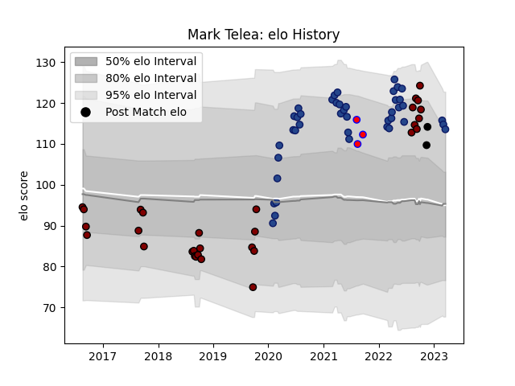

---  
layout: page  
title: Mark Telea  
date: 2023-03-16 20:08:38.530636  
categories: player  
---
# Mark Telea

## Positions: W

## Country: New Zealand

## Current elo: 115.0

## Current Percentile: 91.0

# Elo History

# Match History

| Team          |   Appearances |   Win Rate |
|:--------------|--------------:|-----------:|
| Blues         |            41 |   0.756098 |
| North Harbour |            30 |   0.566667 |
| Tasman        |             3 |   1        |
| New Zealand   |             2 |   0.75     |

| Opponent                 |   Matches |   Win Rate |
|:-------------------------|----------:|-----------:|
| Highlanders              |         9 |   0.888889 |
| Hurricanes               |         6 |   0.666667 |
| Chiefs                   |         6 |   0.666667 |
| Crusaders                |         5 |   0.2      |
| Auckland                 |         4 |   0.25     |
| Brumbies                 |         4 |   0.75     |
| Counties Manukau         |         4 |   1        |
| Hawke's Bay              |         3 |   0.666667 |
| Northland                |         3 |   1        |
| Manawatu                 |         3 |   1        |
| Otago                    |         2 |   0        |
| Southland                |         2 |   1        |
| Canterbury               |         2 |   0        |
| Wellington               |         2 |   0.5      |
| Bay of Plenty            |         2 |   0.5      |
| Melbourne Rebels         |         2 |   1        |
| Waikato                  |         2 |   0.5      |
| Tasman                   |         2 |   0        |
| Taranaki                 |         2 |   1        |
| Queensland Reds          |         2 |   1        |
| Stormers                 |         1 |   1        |
| Fijian Drua              |         1 |   1        |
| Scotland                 |         1 |   1        |
| England                  |         1 |   0.5      |
| Bulls                    |         1 |   1        |
| New South Wales Waratahs |         1 |   1        |
| Moana Pasifika           |         1 |   1        |
| Lions                    |         1 |   1        |
| Western Force            |         1 |   1        |