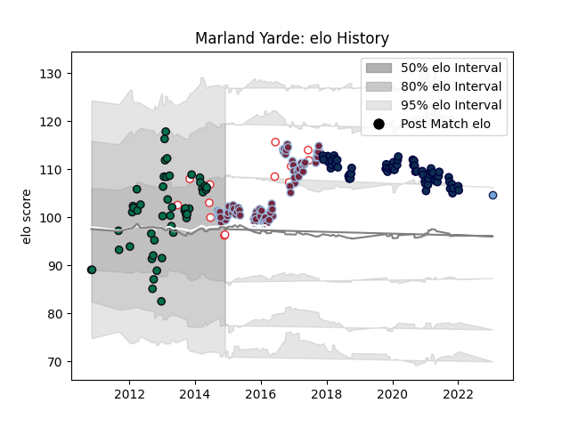

---  
layout: page  
title: Marland Yarde  
date: 2023-01-21 15:42:33.517322  
categories: player  
---
# Marland Yarde

## Positions: W

## Country: England

## Current elo: 96.0

## Current Percentile: 57.0

# Elo History

# Match History

| Team         |   Appearances |   Win Rate |
|:-------------|--------------:|-----------:|
| Harlequins   |            81 |   0.5      |
| Sale Sharks  |            66 |   0.537879 |
| London Irish |            48 |   0.34375  |
| England      |            13 |   0.769231 |
| Bayonne      |             1 |   0        |

| Opponent             |   Matches |   Win Rate |
|:---------------------|----------:|-----------:|
| Leicester Tigers     |        20 |   0.3      |
| Exeter Chiefs        |        18 |   0.111111 |
| Wasps                |        17 |   0.588235 |
| Northampton Saints   |        14 |   0.5      |
| Gloucester Rugby     |        14 |   0.678571 |
| Bath Rugby           |        13 |   0.384615 |
| Sale Sharks          |        12 |   0.541667 |
| Worcester Warriors   |        11 |   0.636364 |
| Newcastle Falcons    |        10 |   0.5      |
| Harlequins           |        10 |   0.3      |
| London Irish         |         9 |   0.833333 |
| Saracens             |         9 |   0.222222 |
| Bristol Rugby        |         7 |   0.714286 |
| Australia            |         4 |   1        |
| Scarlets             |         3 |   0        |
| New Zealand          |         3 |   0        |
| Montpellier Herault  |         3 |   0.333333 |
| Argentina            |         3 |   1        |
| London Welsh         |         3 |   1        |
| La Rochelle          |         3 |   0.333333 |
| Edinburgh            |         2 |   0        |
| Stade Francais Paris |         2 |   0.5      |
| Cardiff Blues        |         2 |   0.5      |
| Castres Olympique    |         2 |   1        |
| Leinster             |         2 |   0.5      |
| Glasgow Warriors     |         2 |   0        |
| Grenoble             |         1 |   1        |
| Lusitanos XV         |         1 |   1        |
| Mont-de-Marsan       |         1 |   1        |
| Calvisano            |         1 |   1        |
| South Africa         |         1 |   1        |
| Lyon                 |         1 |   1        |
| Stade Toulousain     |         1 |   0        |
| Timisoara Saracens   |         1 |   1        |
| Wales                |         1 |   1        |
| Bordeaux Begles      |         1 |   1        |
| Samoa                |         1 |   1        |