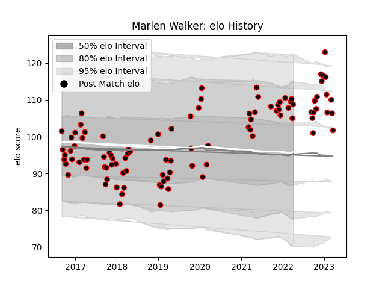

---  
layout: page  
title: Marlen Walker  
date: 2022-12-18 16:13:32.762012  
categories: player  
---
# Marlen Walker

## Positions: P

## Current elo: 96.0

## Current Percentile: 55.0

# Elo History

# Match History

| Team            |   Appearances |   Win Rate |
|:----------------|--------------:|-----------:|
| Cornish Pirates |            65 |   0.484615 |

| Opponent            |   Matches |   Win Rate |
|:--------------------|----------:|-----------:|
| Ealing Trailfinders |         7 |   0.214286 |
| Jersey              |         6 |   0        |
| Doncaster           |         6 |   0.833333 |
| Bedford             |         6 |   0.666667 |
| Yorkshire Carnegie  |         6 |   0.5      |
| Nottingham          |         5 |   0.6      |
| Richmond            |         5 |   0.6      |
| London Scottish     |         4 |   0.75     |
| Rotherham Titans    |         4 |   0.5      |
| Coventry            |         3 |   0.333333 |
| London Irish        |         3 |   0        |
| Ampthill            |         3 |   1        |
| Hartpury College    |         2 |   1        |
| Bristol Rugby       |         2 |   0        |
| Caldy               |         1 |   0        |
| Newcastle Falcons   |         1 |   0        |
| Saracens            |         1 |   1        |