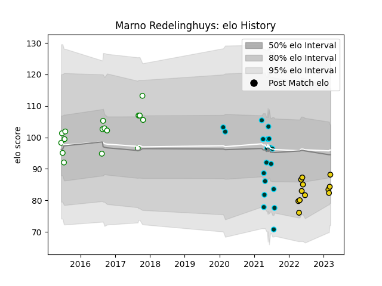

---  
layout: page  
title: Marno Redelinghuys  
date: 2023-03-17 17:36:24.393078  
categories: player  
---
# Marno Redelinghuys

## Positions: L, FL

## Current elo: 88.0

## Current Percentile: 16.0

# Elo History

# Match History

| Team              |   Appearances |   Win Rate |
|:------------------|--------------:|-----------:|
| Rugby ATL         |            19 |   0.736842 |
| Leopards          |            16 |   0.78125  |
| Houston SaberCats |            12 |   0.666667 |

| Opponent               |   Matches |   Win Rate |
|:-----------------------|----------:|-----------:|
| Seattle Seawolves      |         4 |   0.25     |
| Griffons               |         4 |   0.5      |
| Toronto Arrows         |         4 |   0.75     |
| Utah Warriors          |         3 |   1        |
| L. A. Giltinis         |         3 |   0.333333 |
| NOLA Gold              |         3 |   1        |
| SWD Eagles             |         3 |   0.833333 |
| San Diego Legion       |         3 |   1        |
| Valke                  |         2 |   1        |
| Border Bulldogs        |         2 |   1        |
| Dallas Jackals         |         2 |   1        |
| Namibia Welwitchias    |         2 |   1        |
| Boland Cavaliers       |         2 |   1        |
| Old Glory DC           |         2 |   1        |
| R.U. New York          |         2 |   0.5      |
| Rugby New York         |         2 |   0.5      |
| Austin Gilgronis       |         1 |   0        |
| Houston SaberCats      |         1 |   1        |
| Griquas                |         1 |   0        |
| New England Free Jacks |         1 |   1        |