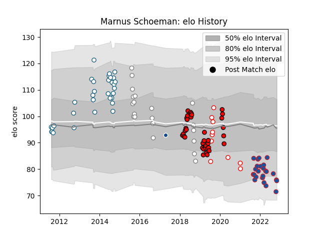

---  
layout: page  
title: Marnus Schoeman  
date: 2023-03-21 17:56:22.872651  
categories: player  
---
# Marnus Schoeman

Last updated: 2023-03-21
## Positions: FL

## Current elo: 76.0

## Current Percentile: 9.0

# Elo History

# Match History

| Team         |   Appearances |   Win Rate |
|:-------------|--------------:|-----------:|
| Lions        |            38 |   0.5      |
| Griquas      |            32 |   0.46875  |
| Grenoble     |            24 |   0.520833 |
| Pumas        |            20 |   0.275    |
| Golden Lions |            10 |   0.6      |
| Bulls        |             1 |   1        |

| Opponent                 |   Matches |   Win Rate |
|:-------------------------|----------:|-----------:|
| Natal Sharks             |        11 |   0.363636 |
| Free State Cheetahs      |         9 |   0.388889 |
| Blue Bulls               |         8 |   0.125    |
| Golden Lions             |         8 |   0.125    |
| Western Province         |         6 |   0.166667 |
| Stormers                 |         5 |   0.6      |
| Griquas                  |         5 |   0.6      |
| Jaguares                 |         5 |   0.8      |
| Sharks                   |         4 |   0.25     |
| Pumas                    |         4 |   0.75     |
| New South Wales Waratahs |         4 |   0.75     |
| Bulls                    |         4 |   0.5      |
| Crusaders                |         3 |   0        |
| Eastern Province Kings   |         3 |   1        |
| Beziers                  |         3 |   0.333333 |
| Brumbies                 |         2 |   0.5      |
| Mont-de-Marsan           |         2 |   0.5      |
| Sunwolves                |         2 |   1        |
| Queensland Reds          |         2 |   0.5      |
| Provence Rugby           |         2 |   0        |
| Oyonnax                  |         2 |   0        |
| Nevers                   |         2 |   1        |
| Narbonne                 |         2 |   0.75     |
| Montauban                |         2 |   1        |
| Melbourne Rebels         |         2 |   0.5      |
| Boland Cavaliers         |         2 |   0.5      |
| Carcassonne              |         2 |   0.5      |
| Leopards                 |         2 |   1        |
| Agen                     |         2 |   0.5      |
| Highlanders              |         2 |   0.5      |
| Hurricanes               |         2 |   0        |
| Blues                    |         1 |   0        |
| Griffons                 |         1 |   1        |
| Border Bulldogs          |         1 |   1        |
| Rouen                    |         1 |   1        |
| SWD Eagles               |         1 |   1        |
| Chiefs                   |         1 |   1        |
| Bayonne                  |         1 |   0        |
| Aurillac                 |         1 |   1        |
| Valke                    |         1 |   1        |
| Vannes                   |         1 |   1        |
| Colomiers                |         1 |   0        |