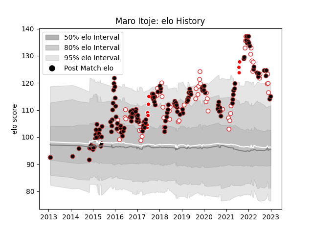

---  
layout: page  
title: Maro Itoje  
date: 2023-03-17 17:17:11.682991  
categories: player  
---
# Maro Itoje

## Positions: L, FL

## Country: England

## Current elo: 99.0

## Current Percentile: 75.0

# Elo History

# Match History

| Team                    |   Appearances |   Win Rate |
|:------------------------|--------------:|-----------:|
| Saracens                |           160 |   0.8125   |
| England                 |            62 |   0.653226 |
| British and Irish Lions |             9 |   0.5      |

| Opponent            |   Matches |   Win Rate |
|:--------------------|----------:|-----------:|
| Exeter Chiefs       |        16 |   0.65625  |
| Northampton Saints  |        14 |   0.857143 |
| Bath Rugby          |        13 |   0.807692 |
| Wasps               |        11 |   0.909091 |
| Harlequins          |        11 |   0.727273 |
| South Africa        |        10 |   0.4      |
| Australia           |         9 |   0.888889 |
| Newcastle Falcons   |         9 |   1        |
| Ireland             |         8 |   0.5      |
| Wales               |         8 |   0.75     |
| Bristol Rugby       |         7 |   0.714286 |
| Sale Sharks         |         7 |   0.857143 |
| Italy               |         7 |   1        |
| Gloucester Rugby    |         7 |   0.714286 |
| France              |         7 |   0.428571 |
| Leicester Tigers    |         6 |   0.666667 |
| Worcester Warriors  |         6 |   1        |
| New Zealand         |         6 |   0.5      |
| Scotland            |         6 |   0.333333 |
| Racing 92           |         5 |   0.8      |
| London Irish        |         5 |   1        |
| Glasgow Warriors    |         4 |   1        |
| Leinster            |         4 |   0.75     |
| Munster             |         4 |   0.75     |
| Toulon              |         3 |   0.666667 |
| Lyon                |         3 |   1        |
| Edinburgh           |         3 |   0.333333 |
| Clermont Auvergne   |         3 |   0.333333 |
| Ospreys             |         3 |   0.833333 |
| Japan               |         2 |   1        |
| Ulster              |         2 |   1        |
| Tonga               |         2 |   1        |
| Cardiff Blues       |         2 |   1        |
| Scarlets            |         2 |   0.75     |
| Oyonnax             |         2 |   1        |
| Argentina           |         2 |   0.5      |
| Crusaders           |         1 |   1        |
| Coventry            |         1 |   1        |
| Samoa               |         1 |   1        |
| Nottingham          |         1 |   1        |
| Doncaster           |         1 |   1        |
| Ealing Trailfinders |         1 |   1        |
| Stade Toulousain    |         1 |   1        |
| New Zealand Maori   |         1 |   1        |
| London Welsh        |         1 |   1        |
| Blues               |         1 |   0        |
| Bedford             |         1 |   1        |
| Ampthill            |         1 |   1        |