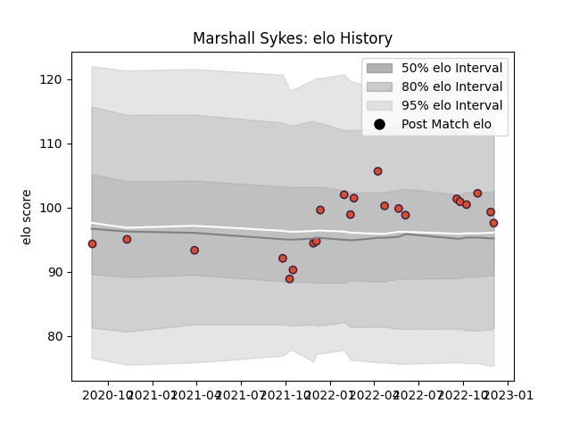

---  
layout: page  
title: Marshall Sykes  
date: 2022-12-18 16:21:15.204294  
categories: player  
---
# Marshall Sykes

## Positions: L

## Current elo: 99.0

## Current Percentile: 66.0

# Elo History

# Match History

| Team      |   Appearances |   Win Rate |
|:----------|--------------:|-----------:|
| Edinburgh |            24 |   0.520833 |

| Opponent          |   Matches |   Win Rate |
|:------------------|----------:|-----------:|
| Dragons           |         3 |   0.666667 |
| Benetton Treviso  |         2 |   0.5      |
| Bulls             |         2 |   0.5      |
| Cardiff Blues     |         2 |   1        |
| Glasgow Warriors  |         2 |   0.5      |
| Munster           |         2 |   0        |
| Saracens          |         2 |   0.5      |
| Stormers          |         2 |   0.25     |
| Castres Olympique |         1 |   1        |
| Leinster          |         1 |   0        |
| Lions             |         1 |   0        |
| Ospreys           |         1 |   0        |
| Pau               |         1 |   1        |
| Scarlets          |         1 |   1        |
| Zebre             |         1 |   1        |