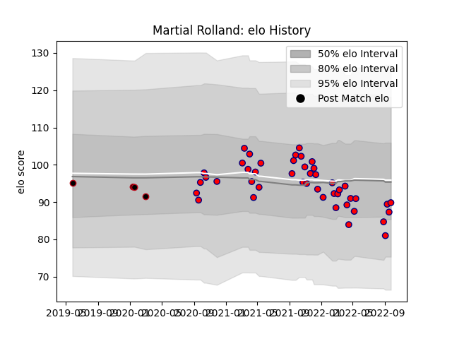

---  
layout: page  
title: Martial Rolland  
date: 2023-02-15 22:14:30.242551  
categories: player  
---
# Martial Rolland

## Positions: L

## Current elo: 94.0

## Current Percentile: 47.0

# Elo History

# Match History

| Team     |   Appearances |   Win Rate |
|:---------|--------------:|-----------:|
| Aurillac |            46 |   0.532609 |
| Lyon     |             4 |   0.25     |

| Opponent                   |   Matches |   Win Rate |
|:---------------------------|----------:|-----------:|
| Grenoble                   |         5 |   0.6      |
| Nevers                     |         4 |   0.5      |
| Carcassonne                |         4 |   0.5      |
| Colomiers                  |         4 |   0.5      |
| Provence Rugby             |         4 |   0.75     |
| Rouen                      |         3 |   0.666667 |
| Mont-de-Marsan             |         3 |   0        |
| Montauban                  |         3 |   0.666667 |
| Agen                       |         2 |   0.5      |
| Soyaux-Angouleme           |         2 |   1        |
| Perpignan                  |         2 |   0.25     |
| Oyonnax                    |         2 |   0.5      |
| Narbonne                   |         2 |   1        |
| Vannes                     |         2 |   0.5      |
| Northampton Saints         |         1 |   0        |
| Beziers                    |         1 |   0        |
| Massy                      |         1 |   1        |
| Leinster                   |         1 |   0        |
| Brive                      |         1 |   0        |
| Biarritz Olympique         |         1 |   0        |
| US Bressane                |         1 |   1        |
| Valence Romans Drome Rugby |         1 |   0        |