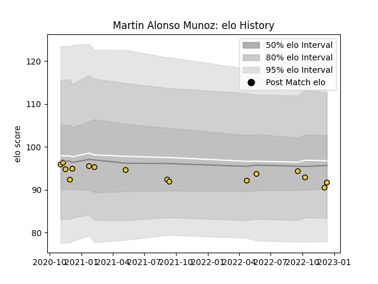

---  
layout: page  
title: Martin Alonso Munoz  
date: 2022-12-09 13:21:12.043636  
categories: player  
---
# Martin Alonso Munoz

## Positions: W

## Current elo: 90.0

## Current Percentile: 35.0

# Elo History

# Match History

| Team        |   Appearances |   Win Rate |
|:------------|--------------:|-----------:|
| La Rochelle |            15 |   0.466667 |

| Opponent             |   Matches |   Win Rate |
|:---------------------|----------:|-----------:|
| Stade Francais Paris |         3 |   0.333333 |
| Bayonne              |         2 |   0.5      |
| Perpignan            |         2 |   1        |
| Racing 92            |         2 |   0        |
| Brive                |         1 |   1        |
| Clermont Auvergne    |         1 |   1        |
| Lyon                 |         1 |   0        |
| Montpellier Herault  |         1 |   0        |
| Pau                  |         1 |   1        |
| Stade Toulousain     |         1 |   0        |