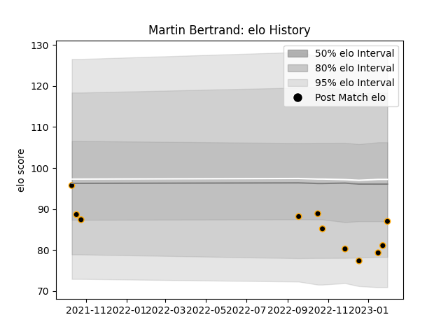

---  
layout: page  
title: Martin Bertrand  
date: 2023-02-02 19:08:46.372334  
categories: player  
---
# Martin Bertrand

## Positions: FL

## Current elo: 87.0

## Current Percentile: 13.0

# Elo History

# Match History

| Team     |   Appearances |   Win Rate |
|:---------|--------------:|-----------:|
| Chambery |            11 |   0.454545 |

| Opponent                   |   Matches |   Win Rate |
|:---------------------------|----------:|-----------:|
| Dax                        |         2 |          0 |
| Albi                       |         1 |          0 |
| Blagnac                    |         1 |          1 |
| Carqueiranne-Hyères        |         1 |          0 |
| Cognac Saint Jean d'Angély |         1 |          1 |
| Rennes                     |         1 |          1 |
| Soyaux-Angouleme           |         1 |          1 |
| Suresnes                   |         1 |          0 |
| Tarbes                     |         1 |          0 |
| US Bressane                |         1 |          1 |