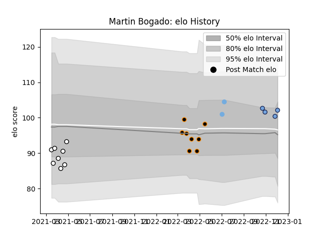

---  
layout: page  
title: Martin Bogado  
date: 2022-12-14 11:34:52.231444  
categories: player  
---
# Martin Bogado

## Positions: FB, W

## Country: Argentina

## Current elo: 100.0

## Current Percentile: 69.0

# Elo History

# Match History

| Team          |   Appearances |   Win Rate |
|:--------------|--------------:|-----------:|
| Jaguares XV   |             8 |       0.75 |
| Olimpia Lions |             8 |       0.5  |
| Bayonne       |             5 |       0.6  |
| Argentina     |             2 |       1    |

| Opponent            |   Matches |   Win Rate |
|:--------------------|----------:|-----------:|
| Cobras              |         4 |   1        |
| Cafeteros Pro       |         3 |   1        |
| Penarol Rugby       |         3 |   0        |
| Selknam             |         3 |   0.333333 |
| Olimpia Lions       |         2 |   1        |
| Georgia             |         1 |   1        |
| Jaguares XV         |         1 |   0        |
| Lyon                |         1 |   1        |
| Montpellier Herault |         1 |   0        |
| Perpignan           |         1 |   1        |
| Portugal            |         1 |   1        |
| Scarlets            |         1 |   0        |
| Stade Toulousain    |         1 |   1        |