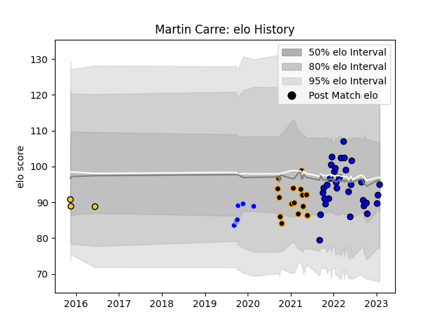

---  
layout: page  
title: Martin Carre  
date: 2023-02-03 18:19:26.749218  
categories: player  
---
# Martin Carre

## Positions: FB, W

## Current elo: 95.0

## Current Percentile: 38.0

# Elo History

# Match History

| Team        |   Appearances |   Win Rate |
|:------------|--------------:|-----------:|
| Massy       |            32 |   0.71875  |
| Chambery    |            15 |   0.433333 |
| Colomiers   |             6 |   0.333333 |
| La Rochelle |             3 |   0        |

| Opponent                   |   Matches |   Win Rate |
|:---------------------------|----------:|-----------:|
| Albi                       |         4 |   0.5      |
| Aubenas                    |         4 |   0.75     |
| Dax                        |         4 |   0.5      |
| Bourgoin-Jallieu           |         3 |   1        |
| Nice                       |         3 |   0.333333 |
| Tarbes                     |         3 |   1        |
| Blagnac                    |         3 |   0.333333 |
| Dijon                      |         2 |   0.5      |
| Soyaux-Angouleme           |         2 |   0.5      |
| Valence Romans Drome Rugby |         2 |   1        |
| Chambery                   |         2 |   1        |
| Rouen                      |         2 |   0.5      |
| Suresnes                   |         2 |   1        |
| Massy                      |         2 |   0.75     |
| Mont-de-Marsan             |         2 |   0        |
| Aurillac                   |         2 |   0.5      |
| Vannes                     |         1 |   1        |
| Perpignan                  |         1 |   0        |
| US Bressane                |         1 |   0        |
| Provence Rugby             |         1 |   0        |
| Montauban                  |         1 |   1        |
| Oyonnax                    |         1 |   0        |
| Nevers                     |         1 |   0        |
| Narbonne                   |         1 |   1        |
| Gloucester Rugby           |         1 |   0        |
| Cognac Saint Jean d'Angély |         1 |   1        |
| Clermont Auvergne          |         1 |   0        |
| Carcassonne                |         1 |   1        |
| Beziers                    |         1 |   0        |
| Worcester Warriors         |         1 |   0        |