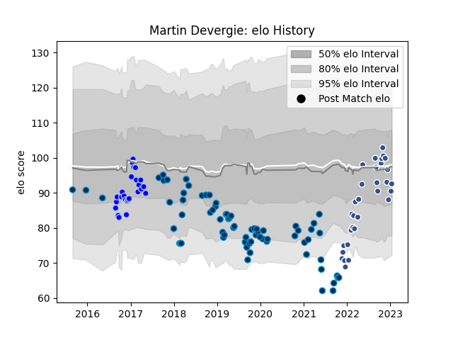

---  
layout: page  
title: Martin Devergie  
date: 2022-11-22 11:29:59.499395  
categories: player  
---
# Martin Devergie

## Positions: N8, FL

## Current elo: 111.0

## Current Percentile: 88.0

# Elo History

# Match History

| Team                |   Appearances |   Win Rate |
|:--------------------|--------------:|-----------:|
| Montpellier Herault |            68 |   0.514706 |
| Agen                |            24 |   0.4375   |
| Colomiers           |             9 |   0.222222 |

| Opponent             |   Matches |   Win Rate |
|:---------------------|----------:|-----------:|
| Toulon               |         6 |   0.666667 |
| Stade Toulousain     |         6 |   0.333333 |
| Stade Francais Paris |         6 |   0.416667 |
| Agen                 |         5 |   0.8      |
| Clermont Auvergne    |         5 |   0.6      |
| Bordeaux Begles      |         5 |   0.5      |
| Racing 92            |         5 |   0.4      |
| Pau                  |         5 |   0.4      |
| Lyon                 |         4 |   0.25     |
| Grenoble             |         4 |   0.5      |
| La Rochelle          |         4 |   0.25     |
| Brive                |         4 |   0.75     |
| Castres Olympique    |         3 |   0.333333 |
| Mont-de-Marsan       |         3 |   0.333333 |
| Bayonne              |         3 |   0.5      |
| Montauban            |         3 |   0        |
| Oyonnax              |         3 |   0.333333 |
| Vannes               |         2 |   1        |
| Aurillac             |         2 |   0        |
| Narbonne             |         2 |   1        |
| Nevers               |         2 |   0.5      |
| Colomiers            |         2 |   0        |
| Perpignan            |         2 |   0.5      |
| Carcassonne          |         2 |   0.5      |
| Bourgoin-Jallieu     |         2 |   0.5      |
| Rouen                |         2 |   0.5      |
| Biarritz Olympique   |         1 |   1        |
| US Bressane          |         1 |   0        |
| Connacht             |         1 |   1        |
| Albi                 |         1 |   0        |
| Soyaux-Angouleme     |         1 |   0        |
| Dax                  |         1 |   0        |
| Gloucester Rugby     |         1 |   1        |
| Cardiff Blues        |         1 |   1        |
| Provence Rugby       |         1 |   1        |