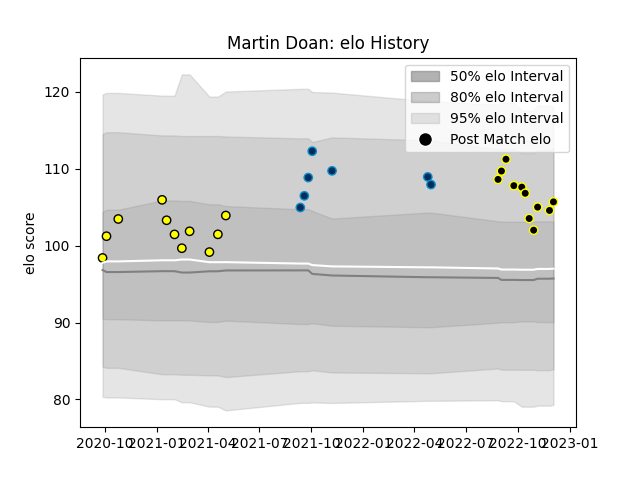

---  
layout: page  
title: Martin Doan  
date: 2023-01-13 11:31:30.654671  
categories: player  
---
# Martin Doan

## Positions: SH

## Current elo: 93.0

## Current Percentile: 41.0

# Elo History

# Match History

| Team                |   Appearances |   Win Rate |
|:--------------------|--------------:|-----------:|
| Albi                |            14 |   0.714286 |
| Mont-de-Marsan      |            13 |   0.615385 |
| Montpellier Herault |             7 |   0.428571 |

| Opponent                   |   Matches |   Win Rate |
|:---------------------------|----------:|-----------:|
| Aurillac                   |         2 |        1   |
| US Bressane                |         2 |        0.5 |
| Dax                        |         2 |        1   |
| Aubenas                    |         2 |        1   |
| Massy                      |         2 |        0   |
| Agen                       |         1 |        0   |
| Lyon                       |         1 |        0   |
| Suresnes                   |         1 |        0   |
| Stade Toulousain           |         1 |        0   |
| Stade Francais Paris       |         1 |        1   |
| Soyaux-Angouleme           |         1 |        1   |
| Rouen                      |         1 |        0   |
| Pau                        |         1 |        0   |
| Nice                       |         1 |        1   |
| Nevers                     |         1 |        1   |
| Montauban                  |         1 |        0   |
| Grenoble                   |         1 |        1   |
| La Rochelle                |         1 |        1   |
| Dijon                      |         1 |        1   |
| Colomiers                  |         1 |        1   |
| Cognac Saint Jean d'Angély |         1 |        1   |
| Chambery                   |         1 |        1   |
| Brive                      |         1 |        1   |
| Bourgoin-Jallieu           |         1 |        1   |
| Bordeaux Begles            |         1 |        0   |
| Blagnac                    |         1 |        0   |
| Biarritz Olympique         |         1 |        1   |
| Beziers                    |         1 |        0   |
| Vannes                     |         1 |        1   |