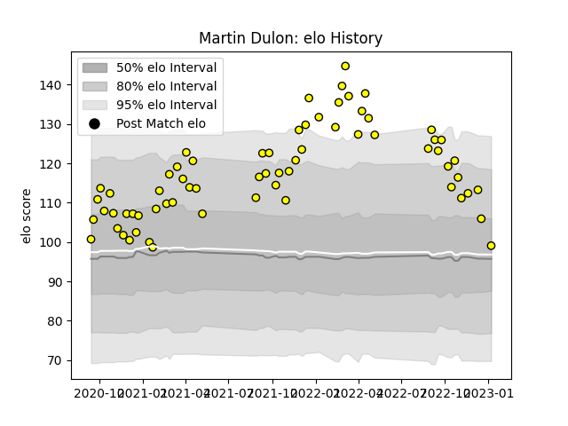

---  
layout: page  
title: Martin Dulon  
date: 2022-11-22 11:33:06.161352  
categories: player  
---
# Martin Dulon

## Positions: W, C

## Current elo: 104.0

## Current Percentile: 76.0

# Elo History

# Match History

| Team        |   Appearances |   Win Rate |
|:------------|--------------:|-----------:|
| Carcassonne |            61 |        0.5 |

| Opponent                   |   Matches |   Win Rate |
|:---------------------------|----------:|-----------:|
| Colomiers                  |         5 |   0.6      |
| Grenoble                   |         5 |   0.4      |
| Aurillac                   |         5 |   0.6      |
| Vannes                     |         4 |   0.375    |
| Provence Rugby             |         4 |   0.25     |
| Beziers                    |         4 |   0.75     |
| Mont-de-Marsan             |         4 |   0.25     |
| Montauban                  |         4 |   0.75     |
| Rouen                      |         4 |   1        |
| Biarritz Olympique         |         3 |   0.333333 |
| Nevers                     |         3 |   0.666667 |
| Oyonnax                    |         3 |   0        |
| Valence Romans Drome Rugby |         2 |   0        |
| Soyaux-Angouleme           |         2 |   0.5      |
| Agen                       |         2 |   0.5      |
| Bayonne                    |         2 |   0.5      |
| Narbonne                   |         2 |   1        |
| Perpignan                  |         1 |   0        |
| Massy                      |         1 |   0        |
| US Bressane                |         1 |   1        |