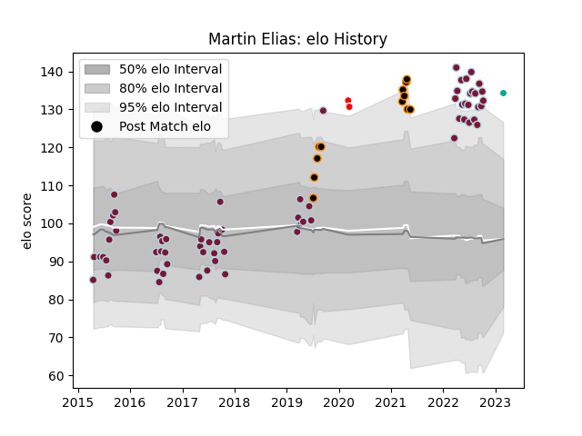

---  
layout: page  
title: Martin Elias  
date: 2023-03-02 11:27:46.849497  
categories: player  
---
# Martin Elias

## Positions: FH, FB

## Current elo: 134.0

## Current Percentile: 98.0

# Elo History

# Match History

| Team                 |   Appearances |   Win Rate |
|:---------------------|--------------:|-----------:|
| Atlético del Rosario |            68 |   0.411765 |
| Jaguares XV          |            12 |   1        |
| Ceibos Rugby         |             2 |   1        |
| Dallas Jackals       |             1 |   0        |

| Opponent            |   Matches |   Win Rate |
|:--------------------|----------:|-----------:|
| Regatas Bella Vista |         7 |  0.571429  |
| SIC                 |         6 |  0.416667  |
| Pucara              |         6 |  0.416667  |
| Belgrano            |         6 |  0.0833333 |
| San Luis            |         6 |  0.5       |
| La Plata            |         6 |  0.333333  |
| CUBA                |         6 |  0.166667  |
| CASI                |         6 |  0.416667  |
| Alumni              |         5 |  0.4       |
| Newman              |         4 |  0.5       |
| Hindu               |         3 |  0         |
| Buenos Aires        |         3 |  0.666667  |
| Selknam             |         3 |  1         |
| Cafeteros Pro       |         2 |  1         |
| Griffons            |         2 |  1         |
| Los Tilos           |         2 |  1         |
| Olimpia Lions       |         2 |  1         |
| Penarol Rugby       |         2 |  1         |
| SWD Eagles          |         1 |  1         |
| Mariano Moreno      |         1 |  1         |
| Pueyrredón          |         1 |  1         |
| Leopards            |         1 |  1         |
| Boland Cavaliers    |         1 |  1         |
| Utah Warriors       |         1 |  0         |