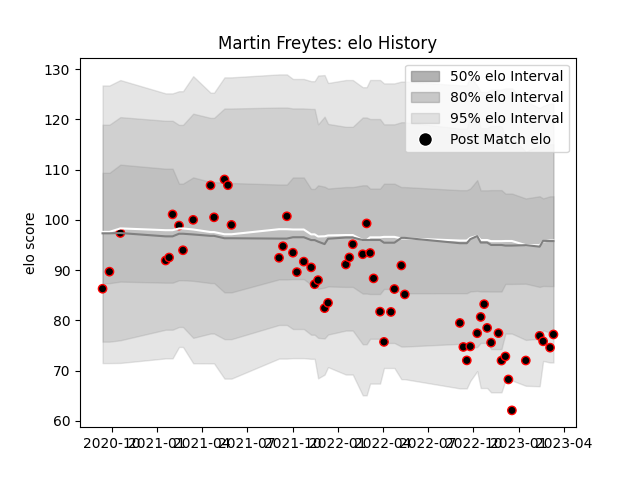

---  
layout: page  
title: Martin Freytes  
date: 2022-12-14 11:21:22.998468  
categories: player  
---
# Martin Freytes

## Positions: N8, L

## Current elo: 89.0

## Current Percentile: 34.0

# Elo History

# Match History

| Team   |   Appearances |   Win Rate |
|:-------|--------------:|-----------:|
| Nice   |            37 |   0.621622 |

| Opponent                   |   Matches |   Win Rate |
|:---------------------------|----------:|-----------:|
| Albi                       |         4 |   0.5      |
| Aubenas                    |         4 |   1        |
| Chambery                   |         4 |   0.5      |
| Bourgoin-Jallieu           |         3 |   0.666667 |
| Dax                        |         3 |   0.333333 |
| Suresnes                   |         3 |   1        |
| Blagnac                    |         2 |   1        |
| Cognac Saint Jean d'Angély |         2 |   0.5      |
| Narbonne                   |         2 |   0        |
| Tarbes                     |         2 |   1        |
| US Bressane                |         2 |   0.5      |
| Valence Romans Drome Rugby |         2 |   0        |
| Carqueiranne-Hyères        |         1 |   1        |
| Massy                      |         1 |   1        |
| Rennes                     |         1 |   1        |
| Soyaux-Angouleme           |         1 |   0        |