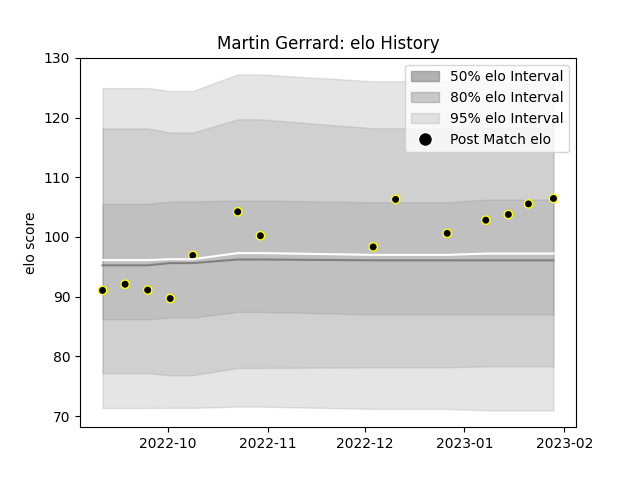

---  
layout: page  
title: Martin Gerrard  
date: 2023-03-21 18:43:16.150742  
categories: player  
---
# Martin Gerrard

Last updated: 2023-03-21
## Positions: FL, L

## Current elo: 102.0

## Current Percentile: 69.0

# Elo History

# Match History

| Team   |   Appearances |   Win Rate |
|:-------|--------------:|-----------:|
| Caldy  |            16 |      0.375 |

| Opponent            |   Matches |   Win Rate |
|:--------------------|----------:|-----------:|
| Ampthill            |         2 |        0   |
| Bedford             |         2 |        0.5 |
| Jersey              |         2 |        0   |
| Nottingham          |         2 |        0.5 |
| Richmond            |         2 |        1   |
| Cornish Pirates     |         1 |        1   |
| Coventry            |         1 |        0   |
| Doncaster           |         1 |        0   |
| Ealing Trailfinders |         1 |        1   |
| Hartpury College    |         1 |        0   |
| London Scottish     |         1 |        0   |