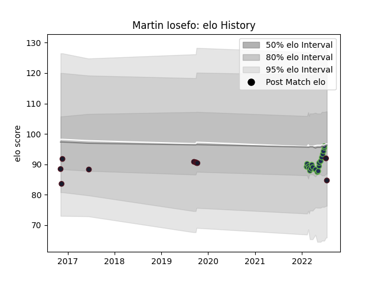

---  
layout: page  
title: Martin Iosefo  
date: 2023-03-17 17:31:49.635711  
categories: player  
---
# Martin Iosefo

## Positions: W

## Country: United States of America

## Current elo: 85.0

## Current Percentile: 41.0

# Elo History

# Match History

| Team                     |   Appearances |   Win Rate |
|:-------------------------|--------------:|-----------:|
| Seattle Seawolves        |            19 |   0.526316 |
| United States of America |            10 |   0.2      |

| Opponent          |   Matches |   Win Rate |
|:------------------|----------:|-----------:|
| San Diego Legion  |         3 |   1        |
| Houston SaberCats |         3 |   0.666667 |
| L. A. Giltinis    |         2 |   0.5      |
| R.U. New York     |         2 |   0        |
| Chile             |         2 |   0.5      |
| Dallas Jackals    |         2 |   1        |
| Rugby New York    |         2 |   0        |
| Austin Gilgronis  |         2 |   0        |
| Toronto Arrows    |         1 |   1        |
| Tonga             |         1 |   0        |
| Romania           |         1 |   0        |
| Argentina         |         1 |   0        |
| New Zealand Maori |         1 |   0        |
| NOLA Gold         |         1 |   0        |
| Ireland           |         1 |   0        |
| France            |         1 |   0        |
| England           |         1 |   0        |
| Canada            |         1 |   1        |
| Utah Warriors     |         1 |   1        |