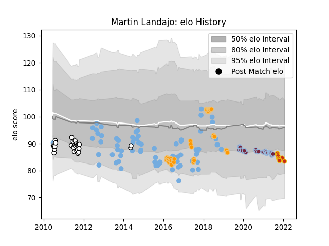

---  
layout: page  
title: Martin Landajo  
date: 2023-03-17 17:15:26.665774  
categories: player  
---
# Martin Landajo

## Positions: SH

## Country: Argentina

## Current elo: 83.0

## Current Percentile: 17.0

# Elo History

# Match History

| Team               |   Appearances |   Win Rate |
|:-------------------|--------------:|-----------:|
| Argentina          |            79 |   0.246835 |
| Jaguares           |            40 |   0.425    |
| Harlequins         |            39 |   0.538462 |
| CASI               |            25 |   0.32     |
| Perpignan          |             8 |   0.375    |
| Argentina Jaguares |             1 |   0        |

| Opponent                  |   Matches |   Win Rate |
|:--------------------------|----------:|-----------:|
| South Africa              |        15 |   0.166667 |
| Australia                 |        14 |   0.142857 |
| New Zealand               |        13 |   0        |
| Lions                     |         7 |   0.285714 |
| England                   |         6 |   0        |
| Scotland                  |         6 |   0        |
| Italy                     |         5 |   1        |
| France                    |         5 |   0.6      |
| Wales                     |         5 |   0.2      |
| Ireland                   |         5 |   0.2      |
| Leicester Tigers          |         4 |   0.625    |
| Sale Sharks               |         4 |   0.5      |
| Sharks                    |         4 |   0.25     |
| Bulls                     |         4 |   0.75     |
| Stormers                  |         4 |   0.25     |
| Bristol Rugby             |         4 |   0.5      |
| London Irish              |         4 |   0.625    |
| Southern Kings            |         3 |   0.333333 |
| Blues                     |         3 |   0.666667 |
| Exeter Chiefs             |         3 |   0.333333 |
| Wasps                     |         3 |   1        |
| La Plata                  |         3 |   0.333333 |
| Gloucester Rugby          |         3 |   0.666667 |
| Bath Rugby                |         3 |   0.666667 |
| Hindu                     |         3 |   0.333333 |
| Alumni                    |         2 |   0        |
| Olivos                    |         2 |   0.5      |
| Newcastle Falcons         |         2 |   0.5      |
| Newman                    |         2 |   0.5      |
| Northampton Saints        |         2 |   0.5      |
| Atlético del Rosario      |         2 |   0        |
| Saracens                  |         2 |   0.5      |
| Ulster                    |         2 |   0        |
| Melbourne Rebels          |         2 |   1        |
| Worcester Warriors        |         2 |   0.5      |
| Clermont Auvergne         |         2 |   0        |
| Chiefs                    |         2 |   0.5      |
| Hurricanes                |         2 |   0        |
| Georgia                   |         2 |   1        |
| Brumbies                  |         2 |   0.5      |
| Tonga                     |         1 |   1        |
| Cheetahs                  |         1 |   1        |
| Champagnat                |         1 |   1        |
| Stade Francais Paris      |         1 |   0        |
| Sunwolves                 |         1 |   1        |
| Lyon                      |         1 |   0        |
| Crusaders                 |         1 |   0        |
| Bordeaux Begles           |         1 |   0        |
| Universitario de La Plata |         1 |   1        |
| Biarritz Olympique        |         1 |   1        |
| Belgrano                  |         1 |   0        |
| Western Force             |         1 |   0        |
| Toulon                    |         1 |   1        |
| San Martin                |         1 |   0        |
| Namibia                   |         1 |   1        |
| San Luis                  |         1 |   0        |
| San Andres                |         1 |   0        |
| San Albano                |         1 |   1        |
| Delta                     |         1 |   1        |
| SIC                       |         1 |   0        |
| Romania                   |         1 |   0        |
| Queensland Reds           |         1 |   0        |
| Pucara                    |         1 |   0        |
| Pau                       |         1 |   0        |
| Dragons                   |         1 |   1        |
| Highlanders               |         1 |   0        |
| Japan                     |         1 |   1        |
| New South Wales Waratahs  |         1 |   1        |
| Manuel Belgrano           |         1 |   0        |