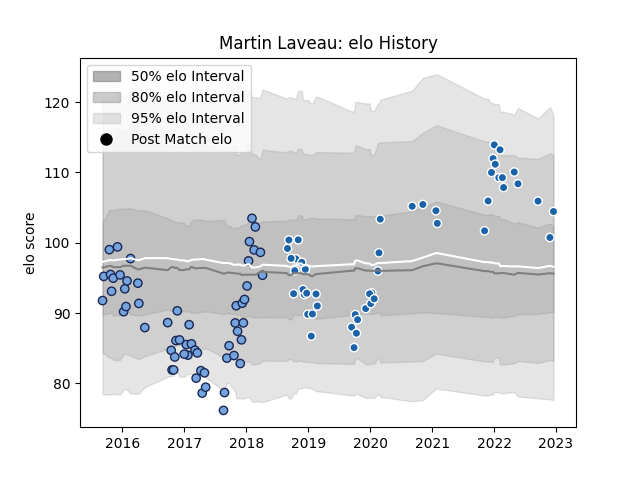

---  
layout: page  
title: Martin Laveau  
date: 2022-12-18 16:36:00.786448  
categories: player  
---
# Martin Laveau

## Positions: W

## Current elo: 105.0

## Current Percentile: 70.0

# Elo History

# Match History

| Team              |   Appearances |   Win Rate |
|:------------------|--------------:|-----------:|
| Bayonne           |            57 |   0.45614  |
| Castres Olympique |            49 |   0.479592 |

| Opponent             |   Matches |   Win Rate |
|:---------------------|----------:|-----------:|
| Perpignan            |         7 |   0.571429 |
| La Rochelle          |         6 |   0.166667 |
| Stade Francais Paris |         6 |   0.333333 |
| Racing 92            |         6 |   0.166667 |
| Bordeaux Begles      |         5 |   0.2      |
| Pau                  |         5 |   0.7      |
| Clermont Auvergne    |         4 |   0.5      |
| Stade Toulousain     |         4 |   0.375    |
| Gloucester Rugby     |         4 |   0.25     |
| Agen                 |         4 |   0.75     |
| Toulon               |         4 |   0.25     |
| Biarritz Olympique   |         4 |   0.75     |
| Carcassonne          |         4 |   0.75     |
| Grenoble             |         3 |   0.333333 |
| Montauban            |         3 |   0.333333 |
| Mont-de-Marsan       |         3 |   0.333333 |
| Lyon                 |         3 |   0.333333 |
| Montpellier Herault  |         3 |   0.333333 |
| Dax                  |         3 |   0.5      |
| Brive                |         2 |   0.5      |
| Massy                |         2 |   1        |
| Beziers              |         2 |   0.5      |
| Munster              |         2 |   0.5      |
| Aurillac             |         2 |   1        |
| Bourgoin-Jallieu     |         2 |   1        |
| Provence Rugby       |         1 |   0        |
| Tarbes               |         1 |   0        |
| Bayonne              |         1 |   0        |
| Soyaux-Angouleme     |         1 |   1        |
| RC Enisei            |         1 |   1        |
| Harlequins           |         1 |   0        |
| Nevers               |         1 |   1        |
| Narbonne             |         1 |   1        |
| Colomiers            |         1 |   1        |
| Dragons              |         1 |   1        |
| Edinburgh            |         1 |   0        |
| Exeter Chiefs        |         1 |   1        |
| Castres Olympique    |         1 |   0        |