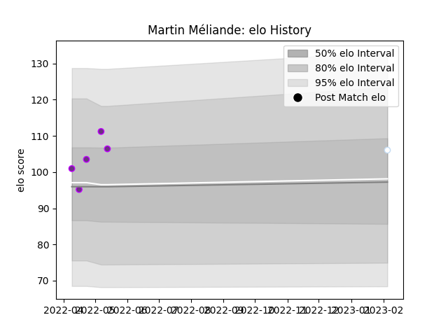

---  
layout: page  
title: Martin Méliande  
date: 2023-02-04 18:28:56.609391  
categories: player  
---
# Martin Méliande

## Positions: FB

## Current elo: 106.0

## Current Percentile: 69.0

# Elo History

# Match History

| Team        |   Appearances |   Win Rate |
|:------------|--------------:|-----------:|
| US Bressane |             5 |        0.4 |
| Racing 92   |             1 |        0   |

| Opponent   |   Matches |   Win Rate |
|:-----------|----------:|-----------:|
| Bayonne    |         1 |          0 |
| Beziers    |         1 |          1 |
| Colomiers  |         1 |          1 |
| Grenoble   |         1 |          0 |
| Nevers     |         1 |          0 |
| Pau        |         1 |          0 |