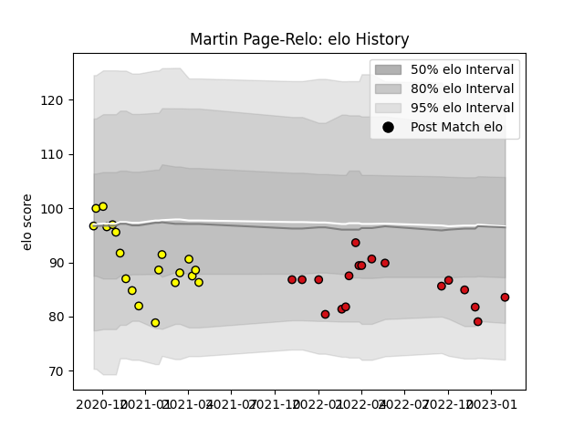

---  
layout: page  
title: Martin Page-Relo  
date: 2023-01-30 17:51:26.178868  
categories: player  
---
# Martin Page-Relo

## Positions: SH

## Current elo: 84.0

## Current Percentile: 10.0

# Elo History

# Match History

| Team             |   Appearances |   Win Rate |
|:-----------------|--------------:|-----------:|
| Carcassonne      |            19 |   0.526316 |
| Stade Toulousain |            18 |   0.527778 |

| Opponent                   |   Matches |   Win Rate |
|:---------------------------|----------:|-----------:|
| Montpellier Herault        |         3 |       1    |
| Aurillac                   |         2 |       0.5  |
| Valence Romans Drome Rugby |         2 |       0    |
| Stade Francais Paris       |         2 |       0.25 |
| Rouen                      |         2 |       1    |
| Provence Rugby             |         2 |       0.5  |
| Perpignan                  |         2 |       1    |
| Pau                        |         2 |       0    |
| Oyonnax                    |         2 |       0    |
| Beziers                    |         2 |       0.5  |
| Nevers                     |         2 |       0.5  |
| Montauban                  |         2 |       1    |
| Lyon                       |         2 |       0.5  |
| Brive                      |         2 |       1    |
| Colomiers                  |         1 |       1    |
| Clermont Auvergne          |         1 |       0    |
| Castres Olympique          |         1 |       0    |
| Soyaux-Angouleme           |         1 |       1    |
| Bordeaux Begles            |         1 |       1    |
| Toulon                     |         1 |       0    |
| Biarritz Olympique         |         1 |       0    |
| Wasps                      |         1 |       0    |