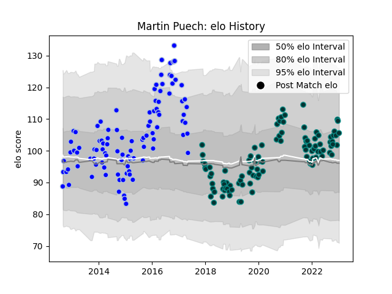

---  
layout: page  
title: Martin Puech  
date: 2023-01-13 11:23:45.762225  
categories: player  
---
# Martin Puech

## Positions: FL

## Current elo: 106.0

## Current Percentile: 81.0

# Elo History

# Match History

| Team      |   Appearances |   Win Rate |
|:----------|--------------:|-----------:|
| Colomiers |           101 |   0.544554 |
| Pau       |           101 |   0.420792 |

| Opponent             |   Matches |   Win Rate |
|:---------------------|----------:|-----------:|
| Brive                |        10 |   0.4      |
| Lyon                 |        10 |   0.2      |
| Aurillac             |         9 |   0.555556 |
| La Rochelle          |         9 |   0.111111 |
| Agen                 |         8 |   0.4375   |
| Perpignan            |         8 |   0.9375   |
| Albi                 |         8 |   0.3125   |
| Stade Francais Paris |         8 |   0.375    |
| Clermont Auvergne    |         8 |   0.375    |
| Stade Toulousain     |         8 |   0.375    |
| Bordeaux Begles      |         8 |   0.5      |
| Toulon               |         7 |   0.357143 |
| Biarritz Olympique   |         7 |   0.571429 |
| Racing 92            |         7 |   0.142857 |
| Montpellier Herault  |         7 |   0.428571 |
| Mont-de-Marsan       |         7 |   0.5      |
| Tarbes               |         7 |   0.428571 |
| Beziers              |         6 |   0.166667 |
| Carcassonne          |         6 |   0.666667 |
| Castres Olympique    |         6 |   0.333333 |
| Dax                  |         5 |   1        |
| Bourgoin-Jallieu     |         5 |   0.6      |
| Montauban            |         5 |   0.6      |
| Narbonne             |         5 |   0.8      |
| Bayonne              |         4 |   0.5      |
| Oyonnax              |         3 |   1        |
| Pau                  |         3 |   0.333333 |
| Provence Rugby       |         3 |   1        |
| Grenoble             |         2 |   1        |
| Massy                |         2 |   0.5      |
| Auch                 |         2 |   1        |
| Vannes               |         1 |   1        |
| US Bressane          |         1 |   1        |
| London Irish         |         1 |   0        |
| Soyaux-Angouleme     |         1 |   1        |
| Leicester Tigers     |         1 |   0        |
| Dragons              |         1 |   1        |
| Cheetahs             |         1 |   0        |
| Cardiff Blues        |         1 |   1        |
| Worcester Warriors   |         1 |   1        |