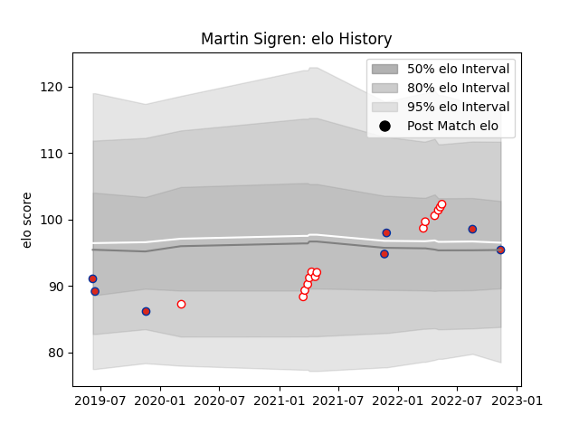

---  
layout: page  
title: Martin Sigren  
date: 2023-03-27 11:36:40.195497  
categories: player  
---
# Martin Sigren

Last updated: 2023-03-27
## Positions: FL

## Country: Chile

## Current elo: 94.0

## Current Percentile: 10.0

# Elo History

# Match History

| Team      |   Appearances |   Win Rate |
|:----------|--------------:|-----------:|
| Selknam   |            19 |   0.684211 |
| Chile     |            10 |   0.3      |
| Doncaster |             1 |   0        |

| Opponent          |   Matches |   Win Rate |
|:------------------|----------:|-----------:|
| Penarol Rugby     |         6 |        0.5 |
| Jaguares XV       |         5 |        0.6 |
| Cafeteros Pro     |         3 |        1   |
| Cobras            |         2 |        1   |
| Olimpia Lions     |         2 |        1   |
| Romania           |         2 |        0   |
| Russia            |         2 |        1   |
| Ampthill          |         1 |        0   |
| Brazil            |         1 |        1   |
| Ceibos Rugby      |         1 |        0   |
| Korea             |         1 |        0   |
| New Zealand Maori |         1 |        0   |
| Portugal          |         1 |        0   |
| Spain             |         1 |        0   |
| Tonga             |         1 |        0   |