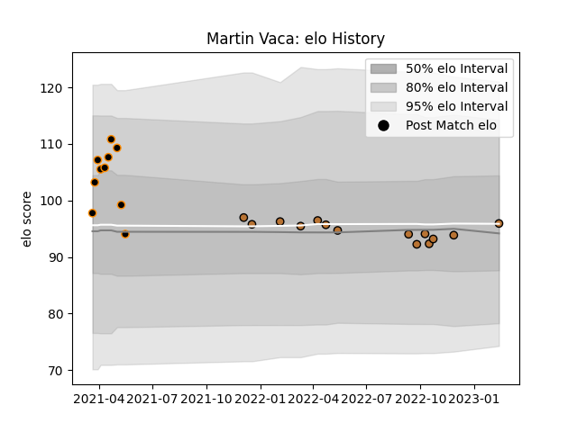

---  
layout: page  
title: Martin Vaca  
date: 2023-02-15 22:14:26.955358  
categories: player  
---
# Martin Vaca

## Positions: H

## Current elo: 96.0

## Current Percentile: 42.0

# Elo History

# Match History

| Team        |   Appearances |   Win Rate |
|:------------|--------------:|-----------:|
| Narbonne    |            14 |       0.25 |
| Jaguares XV |            10 |       1    |

| Opponent                   |   Matches |   Win Rate |
|:---------------------------|----------:|-----------:|
| Penarol Rugby              |         3 |       1    |
| Cafeteros Pro              |         2 |       1    |
| Olimpia Lions              |         2 |       1    |
| Oyonnax                    |         2 |       0    |
| Selknam                    |         2 |       1    |
| Valence Romans Drome Rugby |         2 |       0    |
| Vannes                     |         2 |       0.25 |
| Albi                       |         1 |       0    |
| Bourgoin-Jallieu           |         1 |       0    |
| Cobras                     |         1 |       1    |
| Colomiers                  |         1 |       0    |
| Nevers                     |         1 |       0    |
| Provence Rugby             |         1 |       1    |
| Rennes                     |         1 |       1    |
| Tarbes                     |         1 |       0    |
| US Bressane                |         1 |       1    |