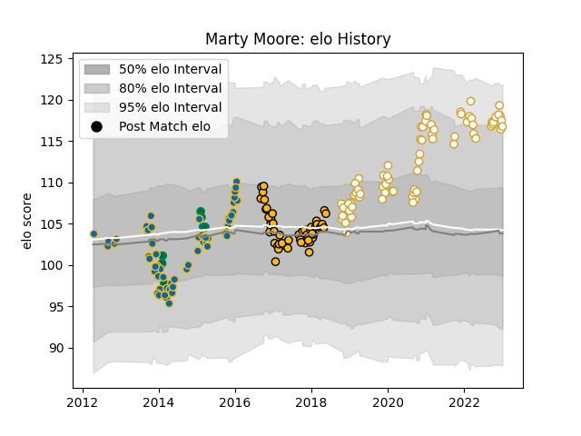

---  
layout: page  
title: Marty Moore  
date: 2023-01-06 00:25:35.741614  
categories: player  
---
# Marty Moore

## Positions: P

## Country: Ireland

## Current elo: 117.0

## Current Percentile: 90.0

# Elo History

# Match History

| Team     |   Appearances |   Win Rate |
|:---------|--------------:|-----------:|
| Ulster   |            72 |   0.673611 |
| Leinster |            58 |   0.698276 |
| Wasps    |            52 |   0.644231 |
| Ireland  |            10 |   0.8      |

| Opponent           |   Matches |   Win Rate |
|:-------------------|----------:|-----------:|
| Scarlets           |        12 |   0.666667 |
| Ospreys            |        12 |   0.625    |
| Connacht           |        11 |   0.727273 |
| Leinster           |        10 |   0.2      |
| Glasgow Warriors   |        10 |   0.75     |
| Munster            |         9 |   0.555556 |
| Dragons            |         9 |   0.888889 |
| Zebre              |         9 |   1        |
| Bath Rugby         |         7 |   0.857143 |
| Leicester Tigers   |         7 |   0.857143 |
| Harlequins         |         7 |   0.714286 |
| Ulster             |         6 |   0.833333 |
| Cardiff Blues      |         6 |   1        |
| Edinburgh          |         6 |   0.833333 |
| Benetton Treviso   |         6 |   0.916667 |
| Sale Sharks        |         5 |   0.4      |
| Newcastle Falcons  |         5 |   0.8      |
| Northampton Saints |         5 |   0.8      |
| Exeter Chiefs      |         5 |   0.5      |
| Gloucester Rugby   |         4 |   0.625    |
| Saracens           |         4 |   0        |
| Toulon             |         4 |   0        |
| La Rochelle        |         3 |   0.333333 |
| Stade Toulousain   |         3 |   0.5      |
| Worcester Warriors |         3 |   1        |
| Castres Olympique  |         3 |   1        |
| Wasps              |         2 |   0.25     |
| Wales              |         2 |   0.5      |
| England            |         2 |   0.5      |
| Clermont Auvergne  |         2 |   0.5      |
| Scotland           |         2 |   1        |
| Italy              |         2 |   1        |
| Racing 92          |         2 |   0.5      |
| France             |         2 |   1        |
| Southern Kings     |         1 |   1        |
| Stormers           |         1 |   0        |
| Cheetahs           |         1 |   1        |
| London Irish       |         1 |   1        |
| Bulls              |         1 |   0        |